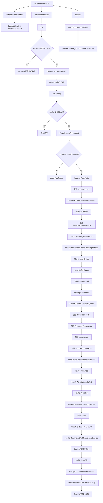

## 1. 新建ohmyworker对象

读取配置文件中的属性。

根据配置文件中的属性，新建一个ohmyworker的对象。

## 2.通过配置信息，尝试连接server并设置值

1. 通过配置文件中的server，ip和端口，生成一个真实的服务地址。

2. 利用OKHttpClient给服务器发送get请求，请求调用的server接口为（/server/assert?appName=%s），appName指当前worker配置的appName

server端应当返回

success：成功标识

data：一个Long类型的appid（此appId是否是之前传的appName？）

> 看到后面操作后，感觉此appId为服务端返回的负责处理此worker的appId

将以上得到的所有信息放入workerRuntime对象中。

> 这里大胆猜测，workerRuntime是worker端用来存放所有运行时配置的类。此类的生命周期等同于worker应用。如果想要在运行中修改worker的某些配置，可以直接修改此类。（是否就可实现不需要重启服务，修改服务配置？）

3. 获取本机的连接信息，也放入WR中。
4. 创建一个定时线程池（核心线程数3）

初始化连接server相关的配置。

通过AppId和WR中的配置创建ServerDiscoveryService对象。

利用ServerDiscoveryService对象连接sever。

## 3.discovery方法

> 用来测试worker和server的连接，并选择出当前worker归哪个server的方法

1. 连接前，先将所有的配置文件中的服务器，设置到ip2Address中。

2. ServerDiscoveryService对象中有currentServerAddress属性

此属性表示worker当前指定的server

如果有指定的server，就返回当前server

否则通过调用“/server/acquire?appId=%d&currentServer=%s&protocol=AKKA”接口

确认当前机器或server服务器是否失活

检测失活过程中服务器会重试3次。（如果判断服务器失活，worker会自动关闭当前机器上所有的秒级任务，原因：认为server已将秒级任务分配给了其他worker应用）。

之后，通过之前创建的定时线程池每十秒不断递归discovery方法。

## 4.初始化 ActorSystem

> akka用来传递消息，server与worker

通过读取提前准备号的akka配置文件，创建一个ActorSystem，将此ActorSystem交给WR。

> 初始化ActorSystem过程中，会将多个参数交给WR。同时给ActorSystem设置了多个指标？？（看不懂）

只知道如果ActorSystem可以用来交互，同时上面设置的某些指标可以用来主动给server告警。

初始化日志系统，创建一个OmsLogHandler交给WR

## 5. 初始化存储

1. 从WR中取出之前的配置文件中的存储方式（磁盘or内存），来初始化一个taskPersistenceService对象

2. 初始化一个数据库连接，（两种方式磁盘or内存）。初始化连接后，会尝试删除上一次H2_PATH配置的文件。
3. 创建一个taskDAO对象，通过taskDAO对象初始化任务表（task_info表）每次重启时，此表都会删除并重新创建
4. 初始化结束，把taskPersistenceService对象交给WR

## 6.初始化定时任务

- 初始化Worker健康度定时上报Runnable，每15秒执行一次

通过CPU核心数，JVM内存空间，硬盘空间使用率，和用户自定义的指标来给当前机器打分

不断地把当前机器的分数提交给sever

- 向定时线程池中添加日志上传任务，每5秒上传一次

不断地将logQueue中的日志取出，交给ActorSystem中给server

logQueue的消费过程中全程上锁。

logqueue.poll()

## 流程图

## 小结

- ohMyWorker

worker的启动类，此类初始化时，会将各种配置信息（config）

> 主要会初始化下面几个对象

- WorkerRuntime

> 类似于spring的ApplicationContext，用来存放所有运行时的配置和信息

- oms，ActorSystem

创建一个ActorSystem，通过oms-worker.akka实现server和worker利用消息来通讯。ActorSystem会创建以下几种消息处理actor

1. 任务跟踪器
2. 处理器跟踪器
3. worker程序调度器
4. 异常处理器

- 定时线程池

用来存放worker的一些预设定时任务

1. 探活任务ServerDiscoveryService.discovery();（用来做服务注册和发现）
2. Worker健康度定时上报（通过CPU核心数，JVM内存空间，硬盘空间使用率，和用户自定义的指标来给当前机器打分）
3. 异步上传日志（不断地将logQueue中的日志取出，交给ActorSystem中给server）

