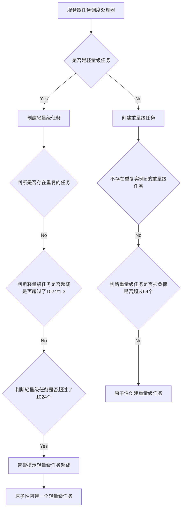
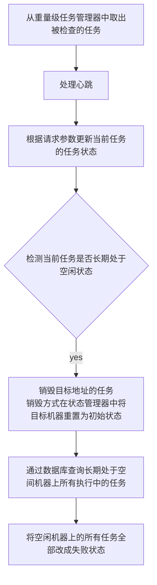
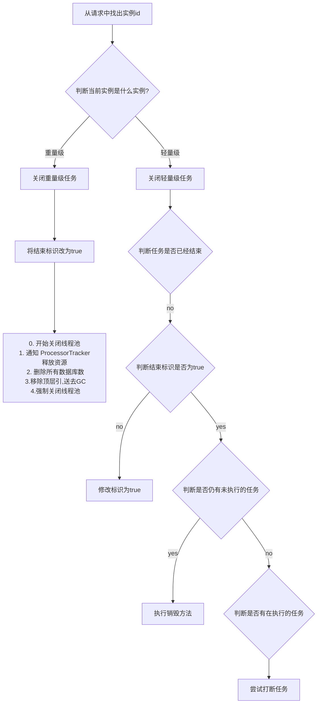
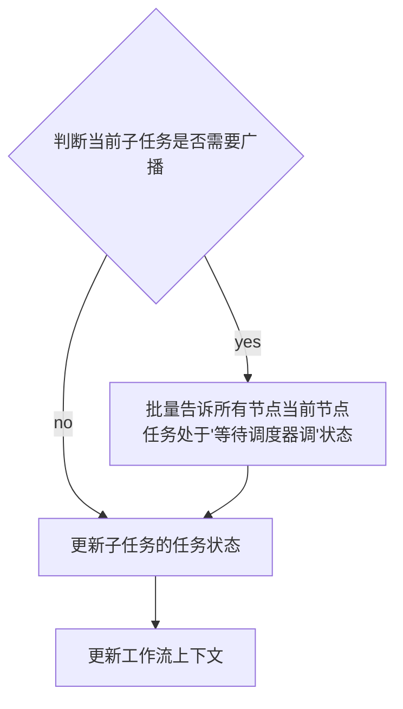
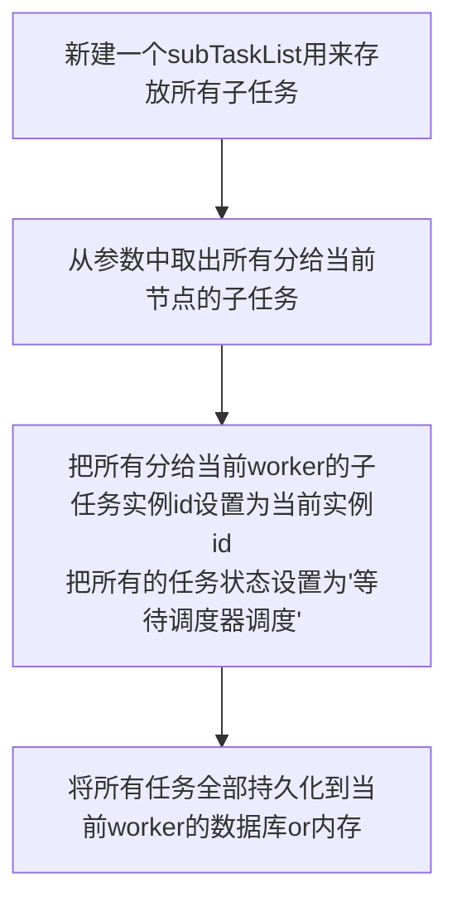

## PowerjobRemoteEngine

用来控制整个Powerjob的网络层

在work启动时创建的一个空对象，后续操作时会用到里面的方法

## EngineConfig

```java
/**
 * 服务类型
 */
private ServerType serverType;
/**
 * 需要启动的引擎类型
 */
private String type;
/**
 * 绑定的本地地址
 */
private Address bindAddress;
/**
 * actor实例，交由使用侧自己实例化以便自行注入各种 bean
 */
private List<Object> actorList;
```

重点是其中的actorList对象，其中包含三个Actor对象：TaskTrackerActor、ProcessorTrackerActor、WorkerActor。


## ActorInfo对象

所有的actor对象拆解后的对象。其中包含所有actor对象，和它下面所有的Handler方法

```java
//   actor对象本身
    private Object actor;
//    当前这个actor对象类上的@Actor注解信息（主要包含path信息）
    private Actor anno;
//当前actor类中所有的HandlerInfo对象
    private List<HandlerInfo> handlerInfos;
```


## HandlerInfo对象

ActorInfo中的属性，包含不同ActorInfo下的Handler修饰的注解，和Handler注解的属性

```java
private HandlerLocation location;
/**
 * handler 对应的方法
 */
private Method method;

/**
 * Handler 注解携带的信息
 */
private Handler anno;
```


## LightTaskTrackerManager

> 轻量级任务管理器

```java
//    用来存放所有轻量级任务，key为实例ID，value是任务对象
private static final Map<Long, LightTaskTracker> INSTANCE_ID_2_TASK_TRACKER = Maps.newConcurrentMap();
```


## HeavyTaskTrackerManager

> 重量级任务管理器

```java
//    用来存放所有的重量级任务
    private static final Map<Long, HeavyTaskTracker> INSTANCE_ID_2_TASK_TRACKER = Maps.newConcurrentMap();
```


## 初始化


以TaskTrackerActor为例

1. 从EngineConfig中取出TaskTrackerActor
2. 创建一个ActorInfo对象和HandlerInfo对象
3. 将所有的ActorInfo和对应的HandlerInfo交给PowerjobRemoteEngine来实现响应式编程（分为阻塞和非阻塞）两种处理方式。利用事件来触发
4. 后续所有的操作，均通过PowerjobRemoteEngine来触发worker和给server发消息。


## TaskTrackerActor


### 服务器任务调度处理器（onReceiveServerScheduleJobReq）

> 服务器触发”runJob“path的命令，worker检测到开始执行。



> 轻量级任务，重量级任务这里分析完全可以单独再做一次研究报告，暂时就不展开了。


### ProcessorTracker 心跳处理器

由"reportProcessorTrackerStatus"命令触发，请求参数中包含实例id

> 由代码推断，只有重量级任务需要上报心跳




- 任务状态参数

```java
private static final int DISPATCH_THRESHOLD = 20;
private static final int HEARTBEAT_TIMEOUT_MS = 60000;

// 冗余存储一份 address 地址
private String address;
// 上次活跃时间
private long lastActiveTime;
// 等待执行任务数
private long remainTaskNum;
// 是否被派发过任务
private boolean dispatched;
// 是否接收到过来自 ProcessorTracker 的心跳
private boolean connected;
```


### 停止任务实例

由“stopInstance”命令触发，请求参数中包含实例id




### 查询任务的运行状态

由“queryInstanceStatus”命令触发，请求参数中包含实例id

查询任务状态的方法，方法设计2中重量级任务和一种轻量级任务的不同查询方式。


### 子任务状态上报处理器

由"reportTaskStatus"命令触发，请求参数中包含实例id

> 只有重量级任务存在子任务状态上报机制




### 子任务 map 处理器

由"mapTask"命令触发，请求参数中包含实例id，和所有的子任务：List<SubTask> subTasks

> 只有重量级任务存在子任务map





