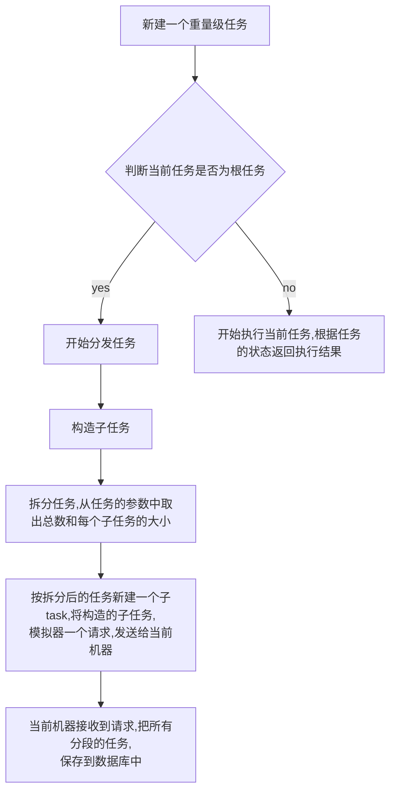
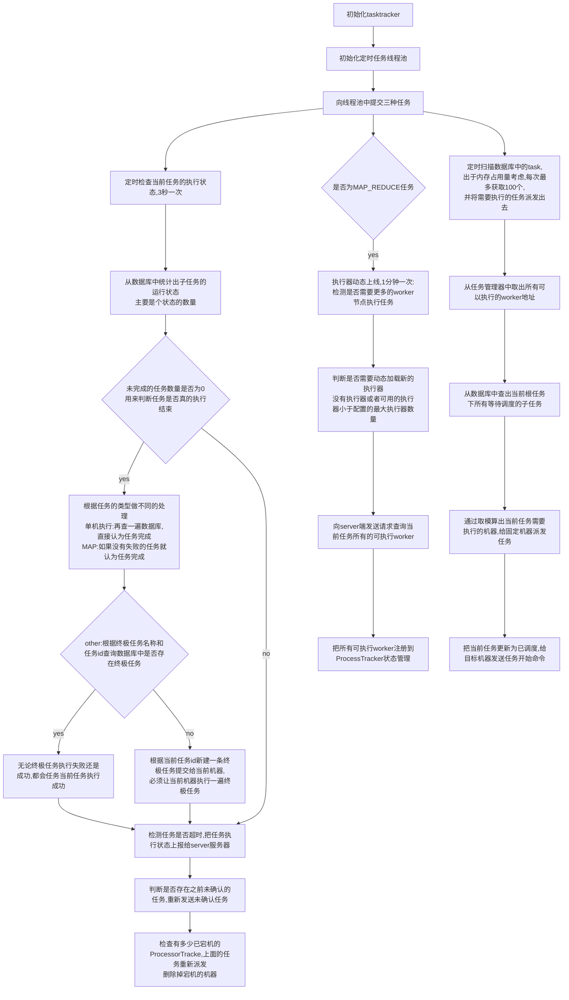

## server的actor（2024-08-21）

### FriendActor(处理其他服务器的请求)

#### 探活（非阻塞的）

直接返回当前服务器注册在hashmap中的所有其他sever服务器

#### 处理其他服务器的请求（阻塞）

服务器之间交互直接通过class文件+方法的方式，直接通过反射创建对应实体类和方法来执行

### WorkerRequestHandlerImpl（处理worker请求）

#### workerHeartbeat（接收worker的心跳）非阻塞

内部维护着一个worker集群状态的map，如果对应appid集群状态有修改，则更新map。

处理完后，写入日志监控器

#### reportInstanceStatus(处理tasktracker上报的任务实例状态)阻塞的

1. 创建一个已经完成任务的事件。
2. 更新工作流中对应的任务
3. 更新任务日志

> 丢弃掉晚上报的请求
>
> 丢弃掉不是server任务管理器中执行机器上报的任务

#### reportLog(处理日志)非阻塞

构造好接收的任务信息，把信息入库

#### queryJobCluster（查询任务的可执行集群）阻塞的

## 关于MapReduce的调研(2024-08-26)

### 任务拆分

> 拆分任务和任务实际的执行逻辑（业务代码），用户只需要自定义任务如何拆分和业务代码。

### 通过TaskTracker来处理子任务

上回书说到map会将大任务拆分成子任务保存到自己机器的数据库中

> 拆分后每个任务分片的调度原理，使用者无感

