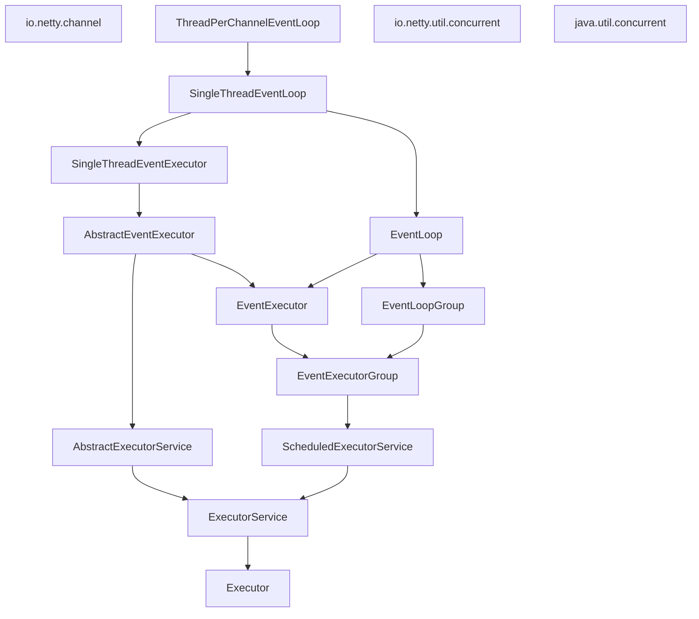

## 第七章、EventLoop和线程模型


- java5的线程池化技术


- 存在的问题

虽然可以重用线程，但是并不能消除由上下文切换带来的开销。性能影响将随着线程数量的增加变得明显，且在高负载下愈演愈烈。


### EventLoop接口




一个EventLoop将由一个永远不会改变的Thread驱动，同时任务（Runnable或者Callable）可以直接提交给EventLoop实现，以立即执行或者调度执行。


- Netty4中的IO事件处理

I/O 操作触发的事件将流经安装了一个或者多个 ChannelHandler 的 ChannelPipeline。传播这些事件的方法调用可以随后被Channel-  Handler 所拦截，并且可以按需地处理事件。


- Netty3中的IO操作

入站事件会在IO线程中执行，所有的出站事件由调用线程处理。（需要额外的线程，导致上下文切换带来损耗）。


### 任务调度


- JDK的任务调度

jdk提供了JUC包，可以定义一个任务调度线程池

存在的弊端：需要多个线程，存在上下文切换问题

```java
//    jdk是如何做任务调度的
    public void jdkC(){
//        创建一个任务线程池
        ScheduledExecutorService executor = Executors.newScheduledThreadPool(10);
//        每60秒执行一次
        executor.schedule(() -> System.out.println("60 seconds later"),60, TimeUnit.SECONDS);
//        关闭线程池
        executor.shutdown();
    }
```


- EventLoop任务调度


```java
//    利用EventLoop停止一个任务
    public void EventLoopC(Channel ch){
//        通过EventLoop创建一个任务调度，60s后开始，每60s执行一次
        ScheduledFuture<?> future = ch.eventLoop().scheduleAtFixedRate(() -> System.out.println("60s seconds later"), 60,60, TimeUnit.SECONDS);
//        创建一个停止任务的表示
        boolean mayInterruptIfRunning=false;
//        取消任务
        future.cancel(mayInterruptIfRunning);
    }
```


- EventLoop的优势

Netty的EventLoop扩展了ScheduledExecutorService，它实现了JDK可用的所有方法。


### 实现细节

- 线程管理

Netty线程模型的卓越取决于对于当前Thread的确定。可以确定它是分配给当前Channel以及它的EventLoop的哪个线程。

如果（当前）调用线程正是支撑EventLoop的线程，那么所提交的代码块将会被（直接）执行。否则EventLoop将调度该任务以便稍后执行，并将它放入到内部队列中。当EventLoop下次处理它的事件时，它会执行队列中的那些任务。


> 永远不要将一个长时间运行的任务放入到执行队列中，因为它将阻塞需要在同一线程上执行的任何其他任务。如果需要执行长时间运行的任务，建议新建一个专门的EventExecutor


- EventLoop/线程的分配

EventLoop包含在EventLoopGroup中，根据不同的传输实现，EventLoop的创建和分配方式不同。


1. 异步传输


EventLoopGroup负责为每个新创建的Channel分配一个EventLoop。使用轮询的方式进行分配以获取一个均衡的分布，相同的EventLoop可能会被分配给多个Channel。

一旦一个Channel被分配给了一个EventLoop，它将在它的整个生命周期中都使用这个EventLoop（以及相关的Thread）。

> 因为一个EventLoop支撑了多个Channel，所以对于所有相关的Channel来说，ThreadLocal都是相同的。


2. 阻塞传输


每个Channel的事件都由一个Thread处理


### 总结

- netty线程模型的伸缩性：

> 可伸缩性就是可以通过增加计算资源(CPU，内存)来提供程序的吞吐量或者性能。

由于netty的EventLoop都绑定着一个确定的Thread，所以，可以根据EventLoop的数量来调整cpu核心数量。
