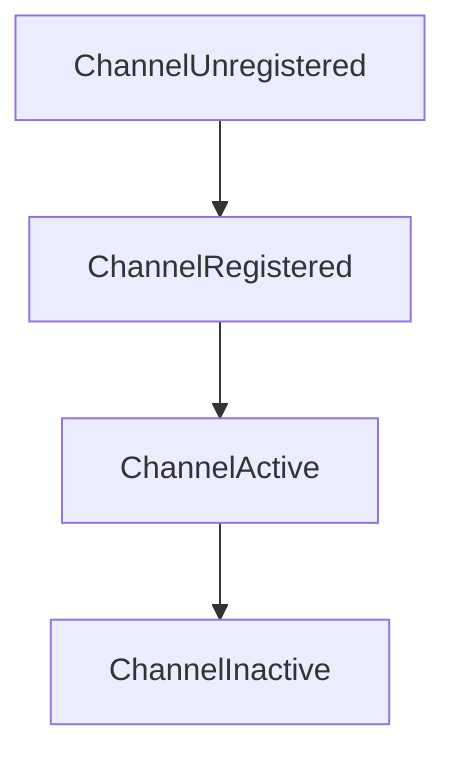
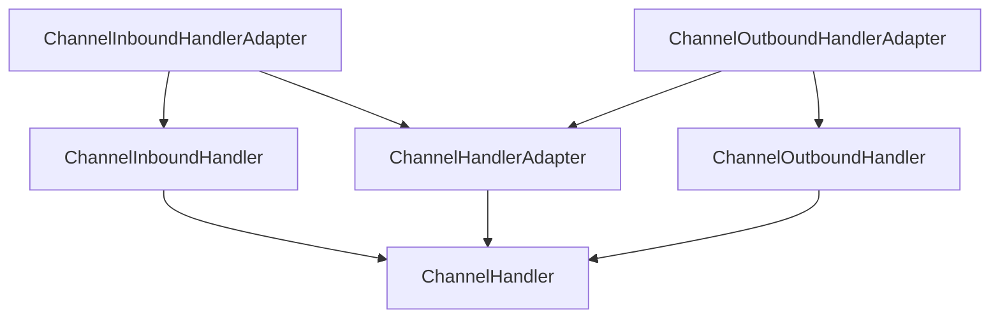

## 第六章、ChannelHandler和ChannelPipeline


### Channelhandler家族


#### Channel的生命周期

| 状态                | 描述                                                         |
| ------------------- | ------------------------------------------------------------ |
| ChannelUnregistered | Channel已经被创建，但还未注册到EventLoop                     |
| ChannelRegistered   | Channel已经被注册到了EventLoop                               |
| ChannelActive       | Channel处于活动状态（已经连接到它的远程节点）可以接收和发送数据了 |
| ChannelInactive     | Channel没有连接到远程节点                                    |





#### ChannelHandler的生命周期

| 类型            | 描述                                              |
| --------------- | ------------------------------------------------- |
| handlerAdded    | 当把ChannelHandler添加到ChannelPipeline中时被调用 |
| handlerRemoved  | 当从ChannelPipeline中移除ChannelHandler时被调用   |
| exceptionCaught | 当处理过程中在ChannelPipeline中有错误产生时被调用 |

ChannelHandler下有两个重要的子接口


- ChannelInboundHandler 接口

> 处理入站数据以及各种状态变化


```java
//利用ChannelInboundHandlerAdapter显式的释放内存
@ChannelHandler.Sharable
public class DiscardHandler extends ChannelInboundHandlerAdapter {
//    用来显式的释放与池化的ByteBuf实例相关的内存
    @Override
    public void channelRead(ChannelHandlerContext ctx, Object msg) throws Exception {
//        丢失已接收的消息
        ReferenceCountUtil.release(msg);
    }
}

//利用SimpleChannelInboundHandler显式的释放内存
class SimpleDiscardHandler extends SimpleChannelInboundHandler<Object>{
    @Override
    protected void channelRead0(ChannelHandlerContext ctx, Object msg) throws Exception {
//        自动释放内存，不需要手动
    }
}
```


- ChannelOutboundHandler 接口

> 处理出站操作的接口，可以按需推迟操作或者事件





### ChannelPipeline接口

> ChannelPipeline是一个拦截流经Channel的入站和出站事件的ChannelHandler实例链。


ChannelPipeline的头部和尾部取决于该事件是入站还是出站的。Netty总是将ChannelPipeline的入站口作为头部，将出站口作为尾部。


- 修改ChannelPipeline

| 名称                                 | 描述                                                         |
| ------------------------------------ | ------------------------------------------------------------ |
| addFirstaddBefore \n addAfteraddLast | 将一个ChannelHandler添加到ChannelPipeline中                  |
| remove                               | 将一个ChannelHandler从ChannelPipeline中移除                  |
| replace                              | 将ChannelPipeline中的一个ChannelHandler替换为另一个ChannelHandler |


> 下面举例中每个Handler应为不同的Handler，这里为了方便全部使用相同的了。

```java
public class ChangeChannelPipeline {
    public void change(ChannelPipeline pipeline){
        C1FirstHandler c1FirstHandler = new C1FirstHandler();
//        尾插第一个Handler名为handler1
        pipeline.addLast("handler1",c1FirstHandler);
//        头插一个Handler名为handler2
        pipeline.addFirst("handler2",c1FirstHandler);
//        尾插
        pipeline.addLast("handler3",c1FirstHandler);
//        按名字删除Handler
        pipeline.remove("handler3");
//        按照Handler类型来删除
        pipeline.remove(c1FirstHandler);
//        把名为handler2的替换
        pipeline.replace("handler2","handler4",c1FirstHandler);
    }
}
```


#### 总结

- ChannelPipeline保存了与Channel相关联的ChannelHandler
- ChannelPipeline可以根据需要，通过添加或者删除ChannelHandler来动态地修改
- ChannelPipeline有丰富的API可以响应入站和出站事件。


### ChannelHandlerContext接口

> 管理它所关联的ChannelHandler和在同一个ChannelPipeline中的其他ChannelHandler之间的交互。


- ChannelHandlerContext和ChannelHandler之间的关联是永远不会改变的，所以缓存对它的引用是安全的。
- ChannelHandlerContext的方法将产生更短的事件流，应该尽可能地利用这个特性来提高性能。


- 通过ChannelHandlerContext访问Handler和Pipeline

```java
public class DemoChannelHandlerContext {
//    通过ChannelHandlerContext访问Channel
    public void getChannel(ChannelHandlerContext ctx){
//        获取与ChannelHandlerContext关联的Channel
        Channel channel = ctx.channel();
//        向Channel中写入数据
        channel.write(Unpooled.copiedBuffer("Netty in Action", CharsetUtil.UTF_8));
    }
//    通过ChannelHandlerContext访问Pipeline
    public void getChannelPipeline(ChannelHandlerContext ctx){
//        获取Pipeline
        ChannelPipeline pipeline = ctx.pipeline();
//        通过Pipeline写入缓冲区
        pipeline.write(Unpooled.copiedBuffer("Netty in Action",CharsetUtil.UTF_8));
    }
}
```


#### 一个事件是如何传递的


### 异常处理


> 入站异常

- ChannelHandler..exceptionCaught()默认实现是将当前异常转发给ChannelPipeline中的下一个ChannelHandler
- 如果异常到达了ChannelPipeline的尾端，它将会被记录为未被处理
- 若想自定义异常处理，需要重写exceptionCaught()方法。然后决定是否将该异常传播出去

```java
//自定义处理入站异常
public class P6InboundExceptionHandler extends ChannelInboundHandlerAdapter {
//    重写exceptionCaught方法
    @Override
    public void exceptionCaught(ChannelHandlerContext ctx, Throwable cause) throws Exception {
        cause.printStackTrace();
        ctx.close();
    }
}
```


> 出站异常

- 每个出站操作都将返回一个ChannelFuture。注册到ChannelFuture的ChannelFutureListener将在操作完成时被通知该操作是成功还是失败。
- 几乎所有的ChannelOutboundHandler上的方法都会被传入一个ChannelPromise实例。作为ChannelFuture的子类，ChannelPromise也可以被分配用于异步通知的监听器。（也可以立即通知）


```java
//自定义出站规则异常处理
public class P6OutboundExceptionHandler extends ChannelOutboundHandlerAdapter {
//    将结果的监听器交给operationComplete
    @Override
    public void write(ChannelHandlerContext ctx, Object msg, ChannelPromise promise) throws Exception {
        promise.addListener(new ChannelFutureListener() {
            @Override
            public void operationComplete(ChannelFuture future) throws Exception {
                if(!future.isSuccess()){
                    future.cause().printStackTrace();
                    future.channel().close();
                    future.channel().closeFuture();
                }
            }
        });
    }
//    通过将监听器交给Future，两种方法效果相同
    public void byChannelFuture(Channel channel){
        ChannelFuture future = channel.write(new Object());
        future.addListener(new ChannelFutureListener() {
            @Override
            public void operationComplete(ChannelFuture future) throws Exception {
                if(!future.isSuccess()){
                    future.cause().printStackTrace();
                    future.channel().close();
                    future.channel().closeFuture();
                }
            }
        });
    }
}
```

