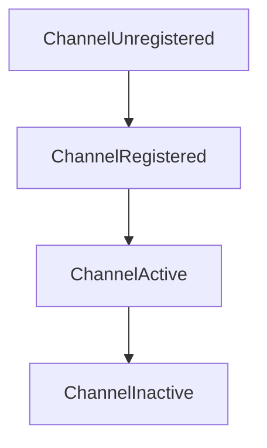
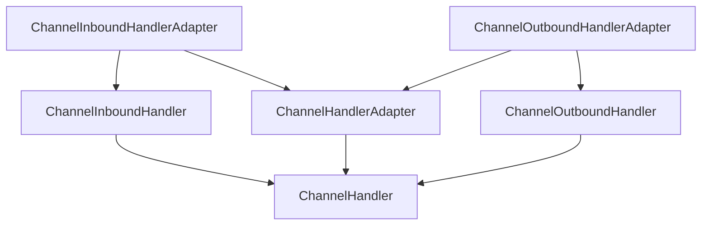
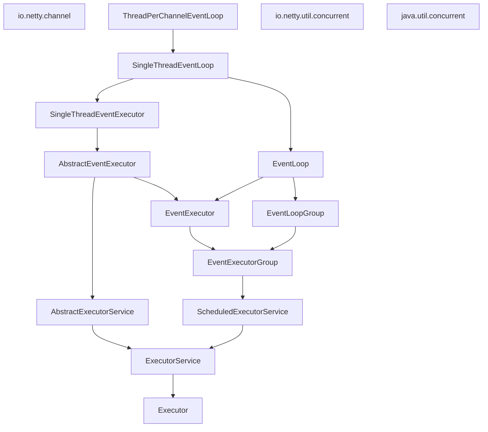

## 第一部分、Netty的概念及体系结构
### 第一章、Netty--异步和事件驱动


#### java早期BIO处理请求方式


早期java阻塞函数处理请求的方式：

```java
public void execute(int port) throws IOException {
//        创建一个新的ServerSocket,用来监听指定端口上的连接请求。
        ServerSocket serverSocket = new ServerSocket(port);
//        对accept()的调用将会被阻塞，直到一个连接建立。
        Socket clientSocket = serverSocket.accept();
        BufferedReader in = new BufferedReader(
                new InputStreamReader(clientSocket.getInputStream()));
        PrintWriter out = new PrintWriter(clientSocket.getOutputStream(), true);
        String request,response;
        while((request=in.readLine())!=null){
//            如果客户端传递了done表示处理结束，退出循环。
            if("Done".equals(request)) break;
//            处理被传递给服务器的处理方法
//            response=processRequest(request);
//            服务器给客户端响应处理结果
            out.println(request);
        }
    }
```


上方代码只能同时处理一个连接，要管理多个并发客户端，需要为每个新的客户端Socket创建一个新的Thread。


- 缺点：

1. 大部分线程几乎都处于休眠状态。

2. 创建的每个线程都需要创建一个栈，每个栈至少都要盛情默认空间的内存。
3. 如果线程多，上下文切换成本高。


#### java NIO

> new or Non-blocking
>
> NIO最开始是新的输入/输出（new Input/output)的英文缩写，但该API已经出现足够长的时间，不再是“新的”了，因此，如今大多数的用户认为NIO代表非阻塞I/O，而阻塞IO是旧的输入/输出。


- NIO的两个优化

1. 使用setsockopt()方法配置套接字，如果没有读写调用的时候就会立刻返回。
2. 可以使用操作系统的时间通知API注册一组非阻塞套接字，以确定它们中是否有任何的套接字已经有数据可供读写。（IO多路复用）。


java.nio.channels.Selector是java的非阻塞IO实现的关键。它使用了事件通知API（IO多路复用）以确认一组非阻塞套接字中有哪些已经就绪能够进行IO相关的操作。因此可以在任何的时间检查任意的读写操作的完成状态。所以可以实现一个线程处理多个并发的连接。


- 优点：

1. 使用较少的线程可以处理许多的连接，减少了内存管理和上下文切换带来的开销。
2. 当没有IO操作需要处理的时候，线程也可以被用于其他任务。


#### Netty简介


Netty的特性总结


| 分类     | Netty的特性                                                  |
| -------- | ------------------------------------------------------------ |
| 设计     | 统一的API，支持多种传输类型，阻塞和非阻塞的 \n 简单而强大的线程模型 \n 真正的无连接数据报套接字支持 \n 链接逻辑组件以支持复用 |
| 易于使用 | 详细的javadoc和大量的示例集 \n                               |
| 性能     | 拥有比java的核心API更高的吞吐量以及更低的延迟\n 得益于池化和复用，拥有更低的资源消耗\n 更小的内存复制 |
| 健壮性   | 不会因为慢速、快速或者超载的连接而导致OutOfMemoryError \n 消除在高速网络中NIO应用程序常见的不公平读写比率 |
| 安全性   | 完整的SSL/TLS 以及StartTLS支持 \n 可用于受限制环境下         |
| 社区驱动 | 发布快速而且频繁                                             |


- 异步和可伸缩性

异步：我们不必等待一个操作的完成。异步方法会立刻返回，并且在它完成时，会直接或稍后的某个时间点通知用户。

可伸缩性：一种系统、网络或者进程在需要处理的工作不断增长时，可以通过某种可行的方式或扩大它的处理能力来适应这种增长的能力。


##### Channel

它表示一个实体（一个硬件设备、一个文件、一个网络套接字或者一个能够执行一个或多个不同IO的操作程序组件）的开放连接，如读操作和写操作。


##### 回调

一个回调其实就是一个方法，一个指向已经被提供给另一个方法的方法引用。这使得被调用者在适当的时候可以回调调用者。是在操作完成后通知相关方常用的方式。


- 回调示例：

```java
/**
 * 当一个连接建立，ChannelHandler回调channelActive方法，打印出连接的地址。
 */
public class ConnectHandler extends ChannelInboundHandlerAdapter {
    @Override
    public void channelActive(ChannelHandlerContext ctx) throws Exception {
        System.out.println("client "+ctx.channel().remoteAddress()+"connected");
    }
}
```


##### Future

Future是另一种在操作完成时通知应用程序的方式。这个对象可以看做是一个异步操作的结果占位符，它将在未来的某个时刻完成，并提供对其结果的访问。


- JDK预设的Future

只允许手动检查对应的操作是否已经完成，或者一直阻塞知道它完成。


- Netty的ChannelFuture

可以注册一个或者多个ChannelFutureListener

1. 监听的回调方法operationComplete()，会在对应的操作完成时被调用。
2. 通过ChannelFuture可以判断该操作是成功还是失败。
3. 通过ChannelFutureListener提供的通知机制，消除了手动检查对应的操作是否完成的必要。

每个IO操作都不会阻塞，所以Netty是完全异步和事件驱动的。


```java
/**
 * 演示利用ChannelFuture处理连接请求，和连接请求的结果。全程不影响其他代码。
 */
public class ChannelFuture1 {
    public void execute(Channel channel){
//        连接会异步的建立，不影响其他逻辑代码。
        ChannelFuture future = channel.connect(new InetSocketAddress("192.168.31.141", 25));
        //给此结果添加一个ChannelFutureListener处理方法，并根据返回结果来做出回应
        future.addListener(new ChannelFutureListener() {
            @Override
            public void operationComplete(ChannelFuture future) throws Exception {
                if(future.isSuccess()){
                    ByteBuf buffer = Unpooled.copiedBuffer("Hello", Charset.defaultCharset());
                    ChannelFuture wf = future.channel().writeAndFlush(buffer);
                }else{
                    Throwable cause = future.cause();
                    cause.printStackTrace();
                }
            }
        });
    }
}
```


##### 事件和ChannelHandler


##### 总结


Netty的异步编程模型建立在Future和回调的概念之上的，而将事件派发到ChannelHandler的方法则发生在更深的层次上。

拦截操作以及高速地转换入站数据和出站数据，都只需要你提供回调或者利用操作所返回的Future。这使得链接操作变得既简单又高效，并且促进了可重用的通用代码的编写。


Netty通过触发事件将selector从应用程序中抽象出来，消除了所有本来将需要手动编写的派发代码。


### 第二章、你的第一个Netty应用程序


#### 不同的事件处理，读取数据的示例

```java
//此注解表示，当前channel-handler可以被多个Channel安全的共享
@ChannelHandler.Sharable
public class EchoServerHandler extends ChannelInboundHandlerAdapter {

//    每个传入的消息都会调用此方法
    @Override
    public void channelRead(ChannelHandlerContext ctx, Object msg) throws Exception {
        ByteBuf in =(ByteBuf) msg;
//        用来读取消息，把消息都记录到控制台
        System.out.println("server received:"+in.toString(CharsetUtil.UTF_8));
//        把收到的消息写给发送者
        ctx.write(in);
    }

//    通知ChannelInboundHandler此消息为最后一条消息
    @Override
    public void channelReadComplete(ChannelHandlerContext ctx) throws Exception {
//        将消息冲刷到远程节点，关闭Channel
        ctx.writeAndFlush(Unpooled.EMPTY_BUFFER)
                .addListener(ChannelFutureListener.CLOSE);
    }
    
//    异常处理
    @Override
    public void exceptionCaught(ChannelHandlerContext ctx, Throwable cause) throws Exception {
        cause.printStackTrace();
        ctx.close();
    }
}
```


- 如果不捕获异常，会发生什么？

每个Channel都拥有一个与之相关联的ChannelPipeline，其持有一个ChannelHandler的实例链。

在默认情况下，ChannelHandler会把它的方法的调用转发给链中的下一个ChannelHandler。因此，如果exceptionCaught（）方法没有被该链中的某处实现，那么所接收的异常将会被传递到ChannelPipeline的尾端并被记录。为此，你的应用程序至少与有一个实现了exceptionCaught（）方法的ChannelHandler。


#### 服务端代码


```java
//服务端主启动类，用来创建channel，绑定通道，实例处理等
public class EchoServer {
    private final int port;
//    新建时指定当前服务的端口。
    public EchoServer(int port){
        this.port=port;
    }

    public static void main(String[] args) {
//        if(args.length!=1) System.out.println("Usage:"+EchoServer.class.getSimpleName()+"<port>");
//        int port=Integer.parseInt(args[0]);
        int port =8080;
        try {
//            启动服务器
            new EchoServer(port).start();
        } catch (InterruptedException e) {
            throw new RuntimeException(e);
        }
    }

    public void start() throws InterruptedException {
        final  EchoServerHandler serverHandler=new EchoServerHandler();
//        创建事件处理线程池
        EventLoopGroup group=new NioEventLoopGroup();
        try {
//            服务器启动器
            ServerBootstrap b = new ServerBootstrap();
//            指定服务器使用哪个线程池
            b.group(group)
//                    指定所使用的channel
                    .channel(NioServerSocketChannel.class)
//                    设置端口号
                    .localAddress(new InetSocketAddress(port))
//                    指定一个EchoServerHandler到子channel的channelPipeline里
                    .childHandler(new ChannelInitializer<SocketChannel>() {
                        @Override
                        protected void initChannel(SocketChannel ch) throws Exception {
//                            上面创建的Handler被标记为@Shareable，可以重复使用相同的实例。
                            ch.pipeline().addLast(serverHandler);
                        }
                    });
//            sync()阻塞线程，直到完成绑定
            ChannelFuture f = b.bind().sync();
//            没有收到closeFuture就一直等待
            f.channel().closeFuture().sync();
        }finally {
//            关闭线程池，释放资源
        group.shutdownGracefully().sync();
        }
    }
}
```


1. EchoServerHandler实现了业务逻辑
2. main方法引导服务器
3. 创建一个ServerBootstrap的实例以引导和绑定服务器
4. 创建并分配一个NioEventLoopGroup实例以进行事件的处理，如接受新连接以及读写数据
5. 指定服务器绑定的本地的InetSocketAddress
6. 使用一个EchoServerHandler的实例初始化每一个新的channel
7. 调用ServerBootstrap.bind()方法来绑定服务器。


#### 客户端代码


- 客户端事件处理代码

```java
@ChannelHandler.Sharable
public class EchoClientHandler extends SimpleChannelInboundHandler<ByteBuf> {
//    在到服务器的连接已经建立之后被调用
    @Override
    public void channelActive(ChannelHandlerContext ctx) throws Exception {
//        建立连接后，发送一条消息！
        ctx.writeAndFlush(Unpooled.copiedBuffer("Netty rocks!", CharsetUtil.UTF_8));
    }

//    当从服务接收到一条消息后被调用
    @Override
    protected void channelRead0(ChannelHandlerContext ctx, ByteBuf msg) throws Exception {
        System.out.println("Client received:"+msg.toString(CharsetUtil.UTF_8));
    }
//    出现异常时调用
    @Override
    public void exceptionCaught(ChannelHandlerContext ctx, Throwable cause) throws Exception {
        cause.printStackTrace();
        ctx.close();
    }
}
```


- 引导客户端代码


```java
public class EchoClient {
    private final String host;
    private final int port;
    public EchoClient(String host,int port){
        this.host=host;
        this.port=port;
    }
    
    public void start() throws InterruptedException {
        NioEventLoopGroup group = new NioEventLoopGroup();
        try {
            Bootstrap b = new Bootstrap();
            b.group(group)
                    .channel(NioSocketChannel.class)
                    .remoteAddress(new InetSocketAddress(host,port))
                    .handler(new ChannelInitializer<SocketChannel>() {
                        @Override
                        protected void initChannel(SocketChannel ch) throws Exception {
                            ch.pipeline().addLast(
                                    new EchoClientHandler()
                            );
                        }
                    });
            ChannelFuture f = b.connect().sync();
            f.channel().closeFuture().sync();
        }finally {
            group.shutdownGracefully().sync();
        }
    }

    public static void main(String[] args) throws InterruptedException {
        String host = "";
        int port=10086;
        new EchoClient(host,port).start();
    }
    
}
```


1. 初始化客户端，创建一个bootstrap实例
2. 为事件处理分配一个nioEventLoopGroup实例，其中事件处理包括创建新的连接以及处理入站和出站数据
3. 为服务器连接创建一个InetSocketAddress实例。
4. 当连接被建立时，一个EchoClientHandler实例被安装到channelPipeline中。
5. 在一切都设置完后，调用bootstrap。connect（）方法连接到远程节点、

### 第三章、Netty的组件和设计


#### Channel、EventLoop和ChannelFuture


Channel：socket

EventLoop：控制流、多线程处理、并发；

ChannelFuture：异步通知。


- Channel接口

用来处理socket连接


- EventLoop接口


1. 一个EventLoopGroup包含一个或者多个EventLoop
2. 一个EventLoop在它的生命周期内只和一个Thread绑定
3. 所有由EventLoop处理的IO事件都将在它专有的Thread上被处理
4. 一个Channel在它的生命周期内只注册于一个EventLoop
5. 一个EventLoop可能会被分配给一个或多个Channel


> 一个给定的Channel的io操作都是由相同的Thread执行的，这样消除了对于同步的需要。


- ChannelFuture接口

一个操作可能不会立刻返回，ChannelFuture接口用来确认其结果。（无论成功还是失败）


#### ChannelHandler和ChannelPipeline


- ChannelHandler接口

Netty的主要组件就是ChannelHandler，他是所有处理入站、出站数据的应用程序逻辑的容器。


- ChannelPipeline接口

ChannelPipeline提供了ChannelHandler链的容器，并定义了用于在该链上传播入站、出站事件流的API。当Channel被创建，它会自动被分配到它专属的ChannelPipeline。


> ChannelHandler安装到ChannelPipeline的过程：


1. 一个ChannelInitializer的实现被注册到ServerBootstrap中。
2. 当ChannelInitializer.initChannel()方法被调用，ChannelInitializer将在ChannelPipeline中安装一组自定义的ChannelHandler；
3. ChannelInitializer将它自己从ChannelPipeline中移除。


- 编码器和解码器

一般，入站数据会从字节转换为我们需要的编码，出站数据要从当前编码转换成字节。


#### 引导


### 第四章、传输


#### 案例研究：传输迁移


> 演示一次从阻塞OIO连接处理到非阻塞NIO迁移，java原生和Netty的迁移成本对比。


- 不通过Netty使用OIO和NIO

```java
public class PlainOioServer {
    public void serve(int port) throws IOException{
//        给服务器绑定指定端口
        final ServerSocket socket=new ServerSocket(port);
        try {
            for (;;){
//                接收连接
                final Socket clientSocket=socket.accept();
                System.out.println("Accepted conection from "+clientSocket);
//                创建一个线程处理连接
                new Thread(new Runnable() {
                    @Override
                    public void run() {
                        OutputStream out;
                        try {
//                            给连接自己的客户端返回消息
                            out=clientSocket.getOutputStream();
                            out.write("Hi!\r\n".getBytes(
                                    Charset.forName("UTF-8")));
                            out.flush();
//                            关闭连接
                            clientSocket.close();
                        } catch (IOException e) {
                            e.printStackTrace();
                        }
                        finally{
                            try {
                                clientSocket.close();
                            } catch (IOException e) {
//                                关闭异常
                            }
                        }
                    }
//                    线程启动
                }).start();
            }
        }catch (Exception e){
            e.printStackTrace();
        }
    }
}
```


上方代码可以处理中等数量的并发客户端。但随着应用程序流行起来，它并不能很好的伸缩到支撑成千上万的并发连入连接。


- 基于java NIO的非阻塞版本

```java
public class PlainNioServer {
    public void serve(int port) throws IOException {
//        创建一个服务器Channel，
        ServerSocketChannel serverChannel = ServerSocketChannel.open();
//        设置当前Channel为非阻塞的
        serverChannel.configureBlocking(false);
//        获取当前Channel的socket对象
        ServerSocket socket = serverChannel.socket();
//        新建一个ip+端口的网络地址
        InetSocketAddress address = new InetSocketAddress(port);
//        把地址绑定到serverSocket对象上
        socket.bind(address);
//        打开selector：开始接收Channel中的事件
        Selector selector = Selector.open();
//        把serverSocket注册到selector上
        serverChannel.register(selector, SelectionKey.OP_ACCEPT);
        final ByteBuffer msg = ByteBuffer.wrap("Hi!\r\n".getBytes());
        for (; ; ) {
            try {
//                开始接收时间，目前处于阻塞状态
                selector.select();
            } catch (IOException e) {
                e.printStackTrace();
                break;
            }
//            获取时间的选择key
            Set<SelectionKey> readyKeys = selector.selectedKeys();
//            开始遍历
            Iterator<SelectionKey> iterator = readyKeys.iterator();
            while (iterator.hasNext()){
                SelectionKey key = iterator.next();
//                开始处理当前上面的key，则删除此key（避免重复处理）
                iterator.remove();
                try {
//                    判断是否就绪（可以被连接）
                    if(key.isAcceptable()){
//                        获取此key的Channel
                        ServerSocketChannel server = (ServerSocketChannel) key.channel();
                        SocketChannel client = server.accept();
                        client.configureBlocking(false);
//                        把当前客户端Channel的读写事件监听注册到selector上
                        client.register(selector,SelectionKey.OP_WRITE|
                                SelectionKey.OP_READ,msg.duplicate());
                        System.out.println("accepted connection from"+client);
                    }
//                    如果写事件就绪
                    if(key.isWritable()){
//                        获取当前客户端的Channel
                        SocketChannel client=(SocketChannel) key.channel();
//                        当前通道的缓存
                        ByteBuffer buffer = (ByteBuffer) key.attachment();
                        while(buffer.hasRemaining()){
//                            把数据写到当前通道
                            if(client.write(buffer)==0){
                                break;
                            }
                        }
//                        关闭连接
                        client.close();
                    }
                } catch (IOException e) {
                    key.cancel();
                    try {
                        key.channel().close();
                    } catch (IOException ex) {
                        System.out.println("关闭失败！");
                        throw new RuntimeException(ex);
                    }
                    throw new RuntimeException(e);
                }
            }
        }
    }
}
```


- 使用Netty的阻塞网络编程


```java
/**
 * Netty OIO演示
 */
public class NettyOioServer {
    public void server(int port) throws InterruptedException {
        final ByteBuf buf = Unpooled.unreleasableBuffer(
                Unpooled.copiedBuffer("Hi!\r\t", StandardCharsets.UTF_8));
//        新建一个事件处理Oio的线程组
        EventLoopGroup group = new OioEventLoopGroup();
        try {
//            创建一个启动引导类
            ServerBootstrap b = new ServerBootstrap();
//            把OIO组绑定到当前引导类
            b.group(group)
//                    给事件组指定处理事件的Channel
                    .channel(OioServerSocketChannel.class)
//                    设计当前server的ip
                    .localAddress(new InetSocketAddress(port))
//                    指定Channel的处理方式,所有连接都会调用此方法
                    .childHandler(new ChannelInitializer<SocketChannel>() {
                        @Override
                        protected void initChannel(SocketChannel ch) throws Exception {
                            ch.pipeline().addLast(
//                                    给当前处理链添加一个拦截处理器
                                    new ChannelInboundHandlerAdapter(){
//                                        处理器实现
                                        @Override
                                        public void channelActive(ChannelHandlerContext ctx) throws Exception {
//                                            把消息写给客户端
                                            ctx.writeAndFlush(buf.duplicate())
                                                    .addListener(
//                                                            写完消息后,触发连接关闭事件
                                                            ChannelFutureListener.CLOSE);
                                        }
                                    });
                        }
                    });
//            绑定服务器来接收连接
            ChannelFuture f = b.bind().sync();
            f.channel().closeFuture().sync();
        }finally {
//            释放所有资源
            group.shutdownGracefully().sync();
        }
    }
}
```


- 基于Netty的异步网络处理

```java
/**
 * 基于Netty的Nio网络连接
 */
public class NettyNioServer {
    public void server(int port) throws InterruptedException {
        final ByteBuf buf = Unpooled.unreleasableBuffer(
                Unpooled.copiedBuffer("Hi!\r\t", StandardCharsets.UTF_8));
//        新建一个事件处理Oio的线程组
        NioEventLoopGroup group = new NioEventLoopGroup();
        try {
//            创建一个启动引导类
            ServerBootstrap b = new ServerBootstrap();
//            把OIO组绑定到当前引导类
            b.group(group)
//                    给事件组指定处理事件的Channel
                    .channel(NioServerSocketChannel.class)
//                    设计当前server的ip
                    .localAddress(new InetSocketAddress(port))
//                    指定Channel的处理方式,所有连接都会调用此方法
                    .childHandler(new ChannelInitializer<SocketChannel>() {
                        @Override
                        protected void initChannel(SocketChannel ch) throws Exception {
                            ch.pipeline().addLast(
//                                    给当前处理链添加一个拦截处理器
                                    new ChannelInboundHandlerAdapter(){
                                        //                                        处理器实现
                                        @Override
                                        public void channelActive(ChannelHandlerContext ctx) throws Exception {
//                                            把消息写给客户端
                                            ctx.writeAndFlush(buf.duplicate())
                                                    .addListener(
//                                                            写完消息后,触发连接关闭事件
                                                            ChannelFutureListener.CLOSE);
                                        }
                                    });
                        }
                    });
//            绑定服务器来接收连接
            ChannelFuture f = b.bind().sync();
            f.channel().closeFuture().sync();
        }finally {
//            释放所有资源
            group.shutdownGracefully().sync();
        }
    }
}
```

只修改了两行代码：

1. 把事件处理的组从OioEventLoopGroup换成了NioEventLoopGroup。
2. 把当前组绑定的时间处理Channel从OioServerSocketChannel.class换成NioServerSocketChannel.class

其他无需修改。


Netty每种传输的实现都暴露相同的API，所以无论选择哪种实现，其他代码几乎都不受影响。


#### 传输API

传输api的核心是Channel接口，它被用于所有的IO操作。


每个Channel都会分配一个ChannelPipeline和ChannelConfig。


- ChannelConfig

包含了该Channel的所有配置设置，并且支持热更新。


- ChannelPipeline

持有所有用于入站和出站数据以及事件的ChannelHandler实例。

ChannelHandler实现了应用程序处理状态变化以及数据处理的逻辑。


- ChannelHandler的用途：

1. 将数据的一种格式转换成另一种格式
2. 提供异常的通知
3. 提供Channel变为活动或者非活动的通知
4. 当Channel注册到EventLoop或者从EventLoop注销时的通知
5. 用户自定义事件的通知。


- Channel的几个重要方法


| 方法名        | 描述                                                         |
| ------------- | ------------------------------------------------------------ |
| eventLoop     | 返回分配给Channel的EventLoop                                 |
| Pipeline      | 返回分配给Channel的ChannelPipeline                           |
| isActive      | 如果Channel是活动的，返回true。（一个socket传输一旦连接到了远程节点便是活动的，一个Datagram传输一旦被打开就是活动的） |
| localAddress  | 返回本地socketAddress                                        |
| remoteAddress | 返回远程socketAddress                                        |
| write         | 把数据写到远程节点。这个数据将被传递给ChannelPipeline，并且排队直到它被冲刷 |
| flush         | 将之前已写的数据冲刷到底层传输，如一个socket                 |
| writeAndFlush | 先调用write然后调用flush                                     |


```java
//    写出数据到Channel
    public void demo1(Channel channel){
//        申请空间
        ByteBuf buf = Unpooled.copiedBuffer("your data", CharsetUtil.UTF_8);
//        写完数据并冲刷（提交）
        ChannelFuture cf = channel.writeAndFlush(buf);
//        添加ChannelFutureListener用来写完后接收通知
        cf.addListener(new ChannelFutureListener() {
            @Override
            public void operationComplete(ChannelFuture future) throws Exception {
                if(future.isSuccess())
                    System.out.println("write successful");
                else{
                    System.err.println("write error");
                    future.cause().printStackTrace();
                }
            }
        });
    }
//    多个线程使用同一个Channel
    public void demo2(Channel channel){
        ByteBuf buf = Unpooled.copiedBuffer("your data", CharsetUtil.UTF_8);
//        创建一个把数据写到Channel的runnable
        Runnable write = new Runnable() {
            @Override
            public void run() {
                channel.writeAndFlush(buf.duplicate());
            }
        };
//        获取一个线程池
        Executor executor= Executors.newCachedThreadPool();
//        把任务提交给一个线程
        executor.execute(write);
//        把任务提交给另一个线程
        executor.execute(write);
    }
```


Netty的Channel是线程安全的，所以无论是提交给一个线程还是多个线程同时调用，都不会有问题。


#### 内置的传输


- Netty所提供的传输


| 名称     | 包                             | 描述                                                         |
| -------- | ------------------------------ | ------------------------------------------------------------ |
| NIO      | io.netty.channel.socket.nio    | 使用java.nio.channels包作为基础--基于选择器的方式            |
| Epoll    | io.netty.channel.epoll         | 由JNI驱动的epoll和非阻塞IO。这个传输支持只有在linux上 可用的多种特性，如SO_REUSEPORT，比NIO传输更快，而且是完全非阻塞的 |
| OIO      | io.netty.channel.oio（已弃用） | 使用java.net包作为基础--使用阻塞流                           |
| local    | io.netty.channel.local         | 可以在VM内部通过管道进行通信的本地传输                       |
| embedded | io.netty.channel.embedded      | 允许使用ChannelHandler而又不需要一个真正基于网络的传输。     |
| kqueue   |                                |                                                              |


- NIO----非阻塞IO

NIO一个所有IO操作完全异步的实现。

> 基于选择器的API

选择器充当了一个注册表，在那里可以请求在Channel的状态发生变化时得到通知。

1. 新的Channel已被接受并且就绪
2. Channel连接已经完成
3. Channel有已经就绪的可供读取的数据
4. Channel可用于写数据


> 选择操作的位模式

| 名称       | 描述                                            |
| ---------- | ----------------------------------------------- |
| OP_ACCEPT  | 请求在接受新连接并创建Channel时获得通知         |
| OP_CONNECT | 请求在建立一个连接时获得通知                    |
| OP_READ    | 请求当数据已就绪，可以从Channel中读取时获得通知 |
| OP_WRITE   | 请求当可以想Channel中写更多数据时获得通知。     |


> 零拷贝（Zero-copy）

目前只有在使用NIO和Epoll传输时才可使用的特性。可以快速高效地将数据从文件系统移动到网络接口，而不需要将其从内核空间复制到用户空间。在FTP或者HTTP这样的协议中可以显著地提高性能。（并不是所有操作系统都支持）

> 零拷贝对于实现了数据加密或者压缩的文件系统是不可用的（只能传输文件的原始内容）


- Epoll--用于Linux的本地非阻塞传输

> Linux专属的NIO API，在高负载下它的性能要优于JDK的NIO实现。

原理和图4-2完全相同。


- OIO-旧的阻塞IO（已废弃）

建立在java.net包的阻塞实现之上的，非异步。


- 用于JVM内部通信的Local传输

用于在同一个JVM中运行的客户端和服务器程序之间的异步通信。


- Embedded传输

Netty提供的额外的传输，可以将一组ChannelHandler作为帮助类嵌入到其他的ChannelHandler内部。


#### 传输的用例


| 传输           | TCP  | UDP  | SCTP | UDT  |
| -------------- | ---- | ---- | ---- | ---- |
| NIO            | Y    | Y    | Y    | Y    |
| Epoll(仅linux) | Y    | Y    | N    | N    |
| OIO            | Y    | Y    | Y    | Y    |


- 每种应用程序推荐的传输方式

| 应用程序的需求                     | 推荐的传输                    |
| ---------------------------------- | ----------------------------- |
| 非阻塞代码库或者一个常规代码的起步 | NIO（或者在Linux上使用epoll） |
| 阻塞代码库                         | OIO                           |
| 同一个JVM内部                      | Local                         |
| 测试ChannelHandler的实现           | Embedded                      |
### 第五章、Bytebuf


#### ByteBuf的API


- 优点

1. 可以被用户自定义的缓冲区类型扩展
2. 通过内置的复合缓冲区实现了透明的零拷贝
3. 容量可以按需增长（类似于JDK的StringBuilder）
4. 在读和写两种模式之间切换不需要调用bytebuffer的flip()方法
5. 读和写使用了不同的索引
6. 支持方法的链式调用
7. 支持引用计数
8. 支持池化


#### ByteBuf类--Netty的数据容器


- 原理

ByteBuf维护了两个不同的索引：一个用于读取，一个用于写入。

当你从ByteBuf中读取时，它的readerIndex将会被递增已经被读取的字节数。

当写入bytebuf时，它的writerIndex也会被递增。


- 下标越界异常

> 当你读取到“可以读取的”数据的末尾（读取指针等于当前写入指针的位置），如果仍试图读取超出该点的数据，会触发IndexOutOfBoundsException


- 堆缓冲区（支撑数组backing array）

> 将数据存储在JVM的堆内存中，可以在没有使用池化的情况下提供快速的分配和释放。


``` java
/**
     * 堆缓冲区方式使用bytebuf。
     * @param buf   缓冲区
     */
    public void byteBufNum(ByteBuf buf){
//        检测bytebuf是否存在支撑数组
        if(buf.hasArray()){
//            获取该支撑数组
            byte[] array = buf.array();
//            计算出当前的偏移量
            int offset = buf.arrayOffset() + buf.readerIndex();
//            获取可读的字节数
            int len = buf.readableBytes();
//            handleArray(array,offset,len);
        }
    }
```


- 直接缓冲区

> 通过直接内存来访问数据，由于缓冲区中的数据不是在JVM内部的所以不会自动垃圾回收。

优点：

理想的网络数据传输选择。传统堆中的缓冲区的数据，JVM在进行网络传输时，会先把堆中的数据复制到堆外，然后再发送。

缺点：

1. 由于数据在堆外，所以分配和释放空间都比较昂贵。
2. 因为数据不在堆上，所以不得不进行一次复制。


``` java
/**
     * 通过直接内存操作缓冲区
     * @param directBuf 缓冲区
     */
    public  void byteBufDirect(ByteBuf directBuf){
//        检测是否存在数组缓冲区，如果不则认为当前缓冲区是直接内存缓冲区
        if(!directBuf.hasArray()){
//            获取当前缓冲区的可读长度
            int length = directBuf.readableBytes();
//            分配字节数组来接收
            byte[] array = new byte[length];
//            从缓冲区读取数据到上方数组
            directBuf.getBytes(directBuf.readerIndex(),array);
//            handleArray(array,offset,len);
        }
    }
```


- 复合缓冲区

> Netty通过一个byteBuf子类--CompositeByteBuf--实现了这个模式，它提供了一个将多个缓冲区表示为单个合并缓冲区的虚拟表示。


将通常不会变动的数据存放到主体缓冲区，将经常变动的数据存放到头部缓冲区。

多个头部缓冲区可以共享同一个主体缓冲区。

将不同的主体和头部组合在一起，可以看做一个不同的缓冲区。

> 这样操作可以避免没有必要的复制。（主体缓冲区始终只有一份）


``` java
/**
     * 复合缓冲区
     * @param headByteBuf 头缓冲区
     * @param bodyBuf 主体缓冲区
     */
    public void ByteBufComposite(ByteBuf headByteBuf,ByteBuf bodyBuf){
        CompositeByteBuf messageBuf = Unpooled.compositeBuffer();
        messageBuf.addComponents(headByteBuf,bodyBuf);
//        访问CompositeByteBuf中的数据
        int length = messageBuf.readableBytes();
//        创建一个用来存放复合缓冲区中数据的空间
        byte[] array = new byte[length];
//        将缓冲区中的数据复制到空间中
        messageBuf.getBytes(messageBuf.readerIndex(), array);
//        删除复合缓冲区中的第一个缓冲区
        messageBuf.removeComponent(0);
        for (ByteBuf buf : messageBuf) {
            System.out.println(buf.toString());
        }
    }
```


#### 字节级操作 ByteBuf相关的操作


- 随机访问索引

直接通过buffer.getByte(i)通过下标访问缓冲区中的数据

这样不会改变readerIndex和writerIndex

- 顺序访问


- 可丢弃的字节

通过调用discardReadBytes()方法来丢弃回收可丢弃的空间。

被回收的空间会用来分配给可写空间中，但不是直接分配。而是会触发一个整理的过程。所有未读的空间整理到内存的头部，再移动可读和可写的下标。


> 会导致内存复制。


- 可读字节

可读字节中的内存存放了真正的数据。

- 可写字节

可写字节表示为被定义、或者写入就绪的内存区域。（这个区域中有可能有部分脏数据）


#### ByteBufHolder接口

> Netty用来管理ByteBuf的接口


| 名称      | 描述                                                         |
| --------- | ------------------------------------------------------------ |
| content() | 返回由这个ByteBufholder所持有的ByteBuf                       |
| copy      | 返回ByteBufHolder的一个深拷贝，包括含有一个其包含的ByteBuf的非共享拷贝 |
| duplicate | 返回ByteBufHolder的一个浅拷贝，包括一个其所包含的ByteBuf的共享拷贝 |


#### ByteBuf分配和管理

> 管理ByteBuf实例的不同方式
##### 按需分配ByteBufAllocator接口

> 实现了ByteBuf的池化技术

```java
//    获取ByteBufAllocator对象
    public void ByteBufAllocator(Channel channel, ChannelHandlerContext ctx){
//        从Channel中获取ByteBufAllocator
        ByteBufAllocator allocator = channel.alloc();
//        从ChannelHandler中获取ByteBufAllocator
        ByteBufAllocator allocator2 = ctx.alloc();
    }
```

Netty提供了两种ByteBufAllocator的实现：

- PooledByteBufAllocator（默认）

池化了ByteBuf的实例以提高性能并最大限度地减少内存碎片，此实现使用了一种称为jemalloc② 的已被大量现代操作系统所采用的高效方法来分配内存。

- UnpooledByteBufAllocator

非池化技术
##### Unpooled缓冲区

有静态的辅助方法，来提供未池化的ByteBuf实例。


##### ByteBufUtil类

提供了用于操作ByteBuf的辅助方法。


#### 引用计数

Netty使用ReferenceCounted实现的引用计数，来管理池化ByteBuf中是否要回收内存。


```java
//    释放ByteBuf的空间
    public void ByteBufReferenceCounted(Channel channel){
//        从Channel中获取池管理器
        ByteBufAllocator allocator = channel.alloc();
//        从池中获取ByteBuf对象
        ByteBuf buffer = allocator.directBuffer();
//        检查当前ByteBuf引用数是否为1
        assert buffer.refCnt()==1;
//        释放内存
        boolean release = buffer.release();
    }
```
### 第六章、ChannelHandler和ChannelPipeline


#### Channelhandler家族


##### Channel的生命周期

| 状态                | 描述                                                         |
| ------------------- | ------------------------------------------------------------ |
| ChannelUnregistered | Channel已经被创建，但还未注册到EventLoop                     |
| ChannelRegistered   | Channel已经被注册到了EventLoop                               |
| ChannelActive       | Channel处于活动状态（已经连接到它的远程节点）可以接收和发送数据了 |
| ChannelInactive     | Channel没有连接到远程节点                                    |





##### ChannelHandler的生命周期

| 类型            | 描述                                              |
| --------------- | ------------------------------------------------- |
| handlerAdded    | 当把ChannelHandler添加到ChannelPipeline中时被调用 |
| handlerRemoved  | 当从ChannelPipeline中移除ChannelHandler时被调用   |
| exceptionCaught | 当处理过程中在ChannelPipeline中有错误产生时被调用 |

ChannelHandler下有两个重要的子接口


- ChannelInboundHandler 接口

> 处理入站数据以及各种状态变化


```java
//利用ChannelInboundHandlerAdapter显式的释放内存
@ChannelHandler.Sharable
public class DiscardHandler extends ChannelInboundHandlerAdapter {
//    用来显式的释放与池化的ByteBuf实例相关的内存
    @Override
    public void channelRead(ChannelHandlerContext ctx, Object msg) throws Exception {
//        丢失已接收的消息
        ReferenceCountUtil.release(msg);
    }
}

//利用SimpleChannelInboundHandler显式的释放内存
class SimpleDiscardHandler extends SimpleChannelInboundHandler<Object>{
    @Override
    protected void channelRead0(ChannelHandlerContext ctx, Object msg) throws Exception {
//        自动释放内存，不需要手动
    }
}
```


- ChannelOutboundHandler 接口

> 处理出站操作的接口，可以按需推迟操作或者事件





#### ChannelPipeline接口

> ChannelPipeline是一个拦截流经Channel的入站和出站事件的ChannelHandler实例链。


ChannelPipeline的头部和尾部取决于该事件是入站还是出站的。Netty总是将ChannelPipeline的入站口作为头部，将出站口作为尾部。


- 修改ChannelPipeline

| 名称                                 | 描述                                                         |
| ------------------------------------ | ------------------------------------------------------------ |
| addFirstaddBefore \n addAfteraddLast | 将一个ChannelHandler添加到ChannelPipeline中                  |
| remove                               | 将一个ChannelHandler从ChannelPipeline中移除                  |
| replace                              | 将ChannelPipeline中的一个ChannelHandler替换为另一个ChannelHandler |


> 下面举例中每个Handler应为不同的Handler，这里为了方便全部使用相同的了。

```java
public class ChangeChannelPipeline {
    public void change(ChannelPipeline pipeline){
        C1FirstHandler c1FirstHandler = new C1FirstHandler();
//        尾插第一个Handler名为handler1
        pipeline.addLast("handler1",c1FirstHandler);
//        头插一个Handler名为handler2
        pipeline.addFirst("handler2",c1FirstHandler);
//        尾插
        pipeline.addLast("handler3",c1FirstHandler);
//        按名字删除Handler
        pipeline.remove("handler3");
//        按照Handler类型来删除
        pipeline.remove(c1FirstHandler);
//        把名为handler2的替换
        pipeline.replace("handler2","handler4",c1FirstHandler);
    }
}
```


##### 总结

- ChannelPipeline保存了与Channel相关联的ChannelHandler
- ChannelPipeline可以根据需要，通过添加或者删除ChannelHandler来动态地修改
- ChannelPipeline有丰富的API可以响应入站和出站事件。


#### ChannelHandlerContext接口

> 管理它所关联的ChannelHandler和在同一个ChannelPipeline中的其他ChannelHandler之间的交互。


- ChannelHandlerContext和ChannelHandler之间的关联是永远不会改变的，所以缓存对它的引用是安全的。
- ChannelHandlerContext的方法将产生更短的事件流，应该尽可能地利用这个特性来提高性能。


- 通过ChannelHandlerContext访问Handler和Pipeline

```java
public class DemoChannelHandlerContext {
//    通过ChannelHandlerContext访问Channel
    public void getChannel(ChannelHandlerContext ctx){
//        获取与ChannelHandlerContext关联的Channel
        Channel channel = ctx.channel();
//        向Channel中写入数据
        channel.write(Unpooled.copiedBuffer("Netty in Action", CharsetUtil.UTF_8));
    }
//    通过ChannelHandlerContext访问Pipeline
    public void getChannelPipeline(ChannelHandlerContext ctx){
//        获取Pipeline
        ChannelPipeline pipeline = ctx.pipeline();
//        通过Pipeline写入缓冲区
        pipeline.write(Unpooled.copiedBuffer("Netty in Action",CharsetUtil.UTF_8));
    }
}
```


##### 一个事件是如何传递的


#### 异常处理


> 入站异常

- ChannelHandler..exceptionCaught()默认实现是将当前异常转发给ChannelPipeline中的下一个ChannelHandler
- 如果异常到达了ChannelPipeline的尾端，它将会被记录为未被处理
- 若想自定义异常处理，需要重写exceptionCaught()方法。然后决定是否将该异常传播出去

```java
//自定义处理入站异常
public class P6InboundExceptionHandler extends ChannelInboundHandlerAdapter {
//    重写exceptionCaught方法
    @Override
    public void exceptionCaught(ChannelHandlerContext ctx, Throwable cause) throws Exception {
        cause.printStackTrace();
        ctx.close();
    }
}
```


> 出站异常

- 每个出站操作都将返回一个ChannelFuture。注册到ChannelFuture的ChannelFutureListener将在操作完成时被通知该操作是成功还是失败。
- 几乎所有的ChannelOutboundHandler上的方法都会被传入一个ChannelPromise实例。作为ChannelFuture的子类，ChannelPromise也可以被分配用于异步通知的监听器。（也可以立即通知）


```java
//自定义出站规则异常处理
public class P6OutboundExceptionHandler extends ChannelOutboundHandlerAdapter {
//    将结果的监听器交给operationComplete
    @Override
    public void write(ChannelHandlerContext ctx, Object msg, ChannelPromise promise) throws Exception {
        promise.addListener(new ChannelFutureListener() {
            @Override
            public void operationComplete(ChannelFuture future) throws Exception {
                if(!future.isSuccess()){
                    future.cause().printStackTrace();
                    future.channel().close();
                    future.channel().closeFuture();
                }
            }
        });
    }
//    通过将监听器交给Future，两种方法效果相同
    public void byChannelFuture(Channel channel){
        ChannelFuture future = channel.write(new Object());
        future.addListener(new ChannelFutureListener() {
            @Override
            public void operationComplete(ChannelFuture future) throws Exception {
                if(!future.isSuccess()){
                    future.cause().printStackTrace();
                    future.channel().close();
                    future.channel().closeFuture();
                }
            }
        });
    }
}
```
### 第七章、EventLoop和线程模型


- java5的线程池化技术


- 存在的问题

虽然可以重用线程，但是并不能消除由上下文切换带来的开销。性能影响将随着线程数量的增加变得明显，且在高负载下愈演愈烈。


#### EventLoop接口




一个EventLoop将由一个永远不会改变的Thread驱动，同时任务（Runnable或者Callable）可以直接提交给EventLoop实现，以立即执行或者调度执行。


- Netty4中的IO事件处理

I/O 操作触发的事件将流经安装了一个或者多个 ChannelHandler 的 ChannelPipeline。传播这些事件的方法调用可以随后被Channel-  Handler 所拦截，并且可以按需地处理事件。


- Netty3中的IO操作

入站事件会在IO线程中执行，所有的出站事件由调用线程处理。（需要额外的线程，导致上下文切换带来损耗）。


#### 任务调度


- JDK的任务调度

jdk提供了JUC包，可以定义一个任务调度线程池

存在的弊端：需要多个线程，存在上下文切换问题

```java
//    jdk是如何做任务调度的
    public void jdkC(){
//        创建一个任务线程池
        ScheduledExecutorService executor = Executors.newScheduledThreadPool(10);
//        每60秒执行一次
        executor.schedule(() -> System.out.println("60 seconds later"),60, TimeUnit.SECONDS);
//        关闭线程池
        executor.shutdown();
    }
```


- EventLoop任务调度


```java
//    利用EventLoop停止一个任务
    public void EventLoopC(Channel ch){
//        通过EventLoop创建一个任务调度，60s后开始，每60s执行一次
        ScheduledFuture<?> future = ch.eventLoop().scheduleAtFixedRate(() -> System.out.println("60s seconds later"), 60,60, TimeUnit.SECONDS);
//        创建一个停止任务的表示
        boolean mayInterruptIfRunning=false;
//        取消任务
        future.cancel(mayInterruptIfRunning);
    }
```


- EventLoop的优势

Netty的EventLoop扩展了ScheduledExecutorService，它实现了JDK可用的所有方法。


#### 实现细节

- 线程管理

Netty线程模型的卓越取决于对于当前Thread的确定。可以确定它是分配给当前Channel以及它的EventLoop的哪个线程。

如果（当前）调用线程正是支撑EventLoop的线程，那么所提交的代码块将会被（直接）执行。否则EventLoop将调度该任务以便稍后执行，并将它放入到内部队列中。当EventLoop下次处理它的事件时，它会执行队列中的那些任务。


> 永远不要将一个长时间运行的任务放入到执行队列中，因为它将阻塞需要在同一线程上执行的任何其他任务。如果需要执行长时间运行的任务，建议新建一个专门的EventExecutor


- EventLoop/线程的分配

EventLoop包含在EventLoopGroup中，根据不同的传输实现，EventLoop的创建和分配方式不同。


1. 异步传输


EventLoopGroup负责为每个新创建的Channel分配一个EventLoop。使用轮询的方式进行分配以获取一个均衡的分布，相同的EventLoop可能会被分配给多个Channel。

一旦一个Channel被分配给了一个EventLoop，它将在它的整个生命周期中都使用这个EventLoop（以及相关的Thread）。

> 因为一个EventLoop支撑了多个Channel，所以对于所有相关的Channel来说，ThreadLocal都是相同的。


2. 阻塞传输


每个Channel的事件都由一个Thread处理


#### 总结

- netty线程模型的伸缩性：

> 可伸缩性就是可以通过增加计算资源(CPU，内存)来提供程序的吞吐量或者性能。

由于netty的EventLoop都绑定着一个确定的Thread，所以，可以根据EventLoop的数量来调整cpu核心数量。
