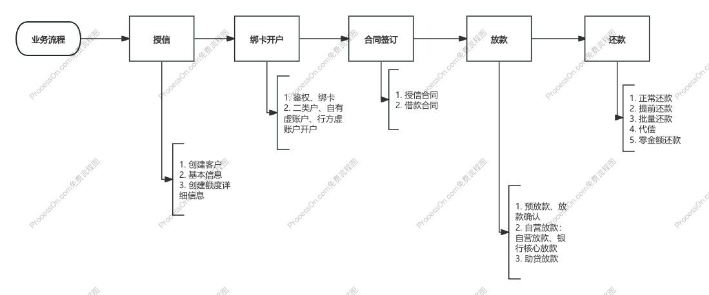
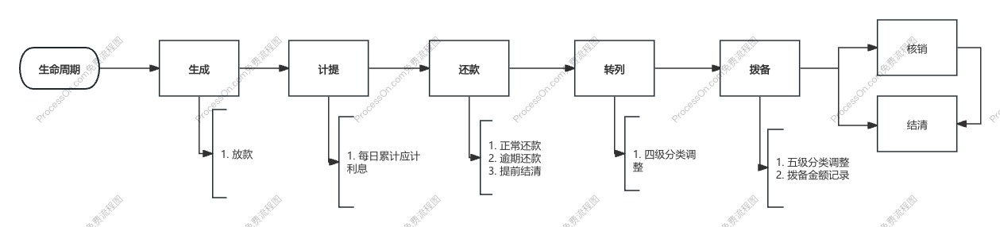

## 业务概览

- 授信
- 放款
- 还款

### 主要业务

>  授信、绑卡、放款、还款、债务重组、不规则还款、延展期、诉讼回款、柜面还款、LPR利率浮动、核销、代偿、机构撤并、管护移交、批量扣款、代偿后还款、日终账务、短信通知、记账机构管理、额度管理、客户信息管理、借据管理、贷款凭证管理、合同管理、核心产品管理、LPR利率维护、银行核心模式、助贷模式、税价分离...

## 联机业务

> 授信维护、绑卡维护、客户基础信息维护、合同维护、管护机构及记账机构维护、放款、还款、借据信息维护等

### 授信

授信是业务开始，只有授信后才能开始贷款。

- 额度：客户在一定时间内能够申请贷款的最高金额
- 业务：变更、冻结、解冻、额度占用、恢复、失效、注销
- 额度类型：循环额度、一次性额度、一次性多次使用额度

### 账户

- 账户：他行卡与本行卡的鉴权、绑定、解绑，用于客户收款和还款

- 鉴权：为了确保用户的真实性和支付的安全性，一般是四要素鉴权

### 放款

- 预防款：完成产品，额度等校验，生成借据号等关键信息。
- 放款确认：再次校验产品、额度等信息，完成额度占用，生成借据、期供等基本信息
- 支付放款：调用支付，完成放款（标准放款、受托支付）
- 核算记账：放款成功后，异步通知会计核算记账

### 还款

- 正常还款：借据到期后的还款
- 提前还款：提前N天还当期
- 提前还N期：缩期，每期本金不变，总期数减少
- 提前还部分：摊薄，每期本金减少，总期数不变

### 其他概念

- 期供：每个借据都有对应的期供，期供记录了每一期还款的本金、利息、开始日、到期日期等。
- 还款方式：等额本金、等额本息、先息后本、一次性还本付息，周期性还本付息，气球贷，不规则还款。
- 利率：正常利率，罚息利率，复息利率
- 优惠券：N天免息券、利率折扣券、N期免息券、固定利率券、利息抵扣券
- 还款日：固定还款日、范围随机还款日、最大还款日、还款日间隔

## 批量任务

> 各种流水状态同步、批量、代偿、银行核心模式行内数据拉取等

### 批量扣款

> 客户借据到期后，每日执行的扣款任务

#### 流程

1. 任务生成：按商户、数据库节点、时间点、支付通道等生成批扣
2. 数据载入：按生成的不同批扣任务，载入对应的需要批扣的数据
3. 执行扣款：按人加产品维度，结合还款账户生成扣款记录，发起扣款
4. 短信发送：客户所有借据扣款完成后，按人维度发送扣款结果短信

#### 业务规则

- 扣款时间

  批扣时间点支持配置，配置三次时间 8、16、20点批扣

- 并发控制

  涉及部分特殊支付渠道的扣款，批扣可以设置不同的并发数量控制

- 扣款账户

  扣款账户的顺序是按照产品维度配置的，主流扣款顺序：自有虚账户-->行内虚账户--> 本行卡--> 他行卡

- 余额查询

  扣款前会查询余额，如果余额不足，按可用余额扣款

- 批扣短信

  扣款完成后，准实时发送扣款短信

  

### 借据代偿

> 借据人无法按时偿还贷款时，由担保人或保险公司等第三方代为偿还的业务

#### 业务流程

1. 代偿试算：命中代偿规则的借据，进行代偿试算，生成代偿明细
2. 申请文件：根据代偿明细，生成批量代偿申请文件，上传OSS
3. 文件通知：申请文件上传完成后，通过支付通知行内代偿申请已提交
4. 审批结果：批量代偿审批文件下载、解析、更新审批状态：通过或拒绝，审批通过的借据，会发起代偿还款
5. 代偿结果：代偿完成后，生成代偿结果文件，上传

#### 业务规则

- 代偿天数

  只借据的逾期天数，分为单期代偿天数、整笔代偿天数

- 代偿方式

  单期代偿：单期天数控制，单期做代偿

  整笔代偿：由整笔借据逾期天数控制，做整笔借据代偿

- 账户管理

  按渠道配置代偿账户，或在借据放款时指定代偿账户

- 文件同步

  还款预估文件、代偿申请文件、代偿审批文件、代偿结果文件的同步

### 借据核销

> 核销后贷款从资产负债表中剔除，相关坏账不计入当期损益

#### 业务流程

1. 商户校验：商户是否支持核销，减值核销或非减值核销，核销时是否检查计提
2. 产品校验：产品是否支持核销，核销贷款余额，核销逾期天数是否满足要求
3. 借据校验：借据状态是否正常，是否处理中，是否做过资产剥离，是否已经核销，贷款余额，逾期天数是否满足条件，最大逾期天数内是否有成功还款记录

#### 业务规则

## 日终任务

> 计提、结息、转列、拨备、计税

### 业务流程

1. 日切前：根据日切时间点，拦截前后10分钟的所有交易
2. 日切中-交易拦截：拦截掉除放款外，其他影响账务的交易
3. 日切中-核心：执行计提、结息、转列、拨备，生成对应文件通知会计核系统处理
4. 日切中-会计核算：处理核心系统计提、结息、转列、拨备等文件
5. 日切中-ODS：待核心系统及会计核算系统数据处理完成后，通知ODS抽数
6. 日间：ODS完成供数后，通知核心切日间，继续处理被阻塞的还款交易，当日零金额还款的业务。

### 业务规则

- 计提

  对当天应收客户的贷款利息进行计算，体现银行的贷款利息收入

- 结息

  按约定的时间从客户账扣收贷款利息，体现银行和借据人之间的利息结算

- 转列

  处理贷款借据的四级分类：正常、逾期、呆滞、呆账

- 拨备

  贷款减值准备，拨备金额主要根据贷款的五级分类来确定

## 总结

