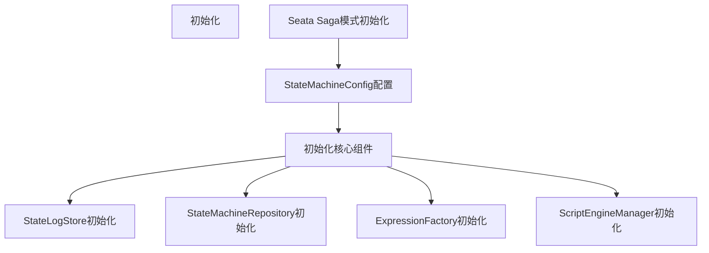
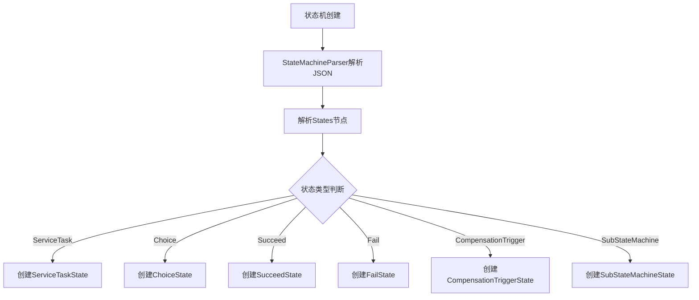
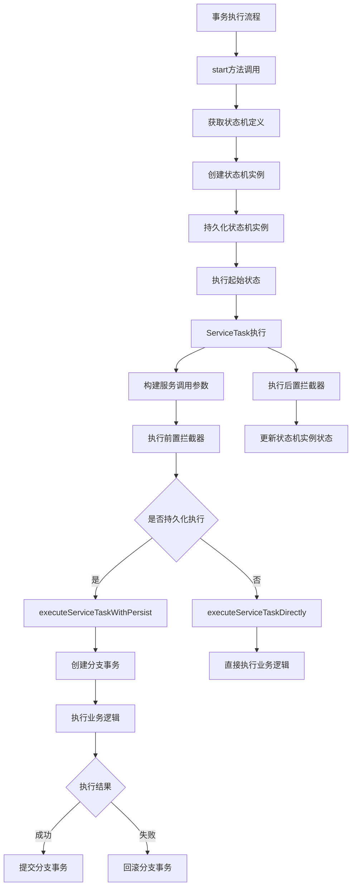
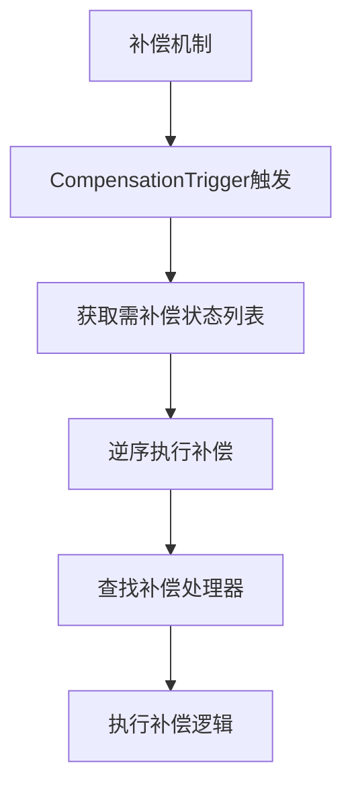
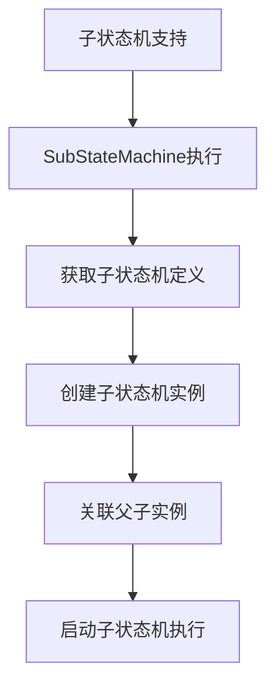

# 从seata源码入手分布式事务


## AT模式（可靠消息队列思想）

> 借用本地ACID事务（硬性事务）数据库实现的分布式事务。
>
> 通过Seata 在内部做了对数据库操作的代理层，让本地数据库操作时会检测全局事务，插入回滚日志等。（**目前仅java支持**）


### 概述

- 整体机制

大致分为两个阶段：

1. 本地提交：把业务数据和undo_log（回滚日志）同时在本地数据库提交，本地数据库释放锁和数据库连接。（**没有释放全局锁**）
2. 全局提交阶段：
   1. 提交事务：异步化提交事务，**释放全局锁**
   2. 事务回滚：执行undo_log中记录的回滚sql，回滚后**释放全局锁**


- 写隔离

对于同一全局锁的数据：一阶段时，A事务持有全局锁，只要A事务不进行二阶段释放全局锁。B事务就始终无法一阶段提交，一阶段提交的必要条件是需要获取全局锁。

**回滚**：如果A事务二阶段回滚，此时B事务持有A事务一阶段相同的本地锁，A事务会回滚失败，但A事务会无限重试回滚（最大努力交付），直到B事务由于获取全局锁超时而回滚释放本地锁。A事务又可以获取本地锁，A事务回滚成功，释放全局锁。（**有效避免了脏写**）


- 读隔离

> 普通select语句是没有读隔离的，可能会读到中间阶段的数据。**读隔离只对select forUpdate语句生效**

A事务持有全局锁没有释放，B事务for update查询数据时，会尝试获取全局锁，获取失败后B事务回滚（**回滚是为了防止出现死锁**），然后重试B事务流程。


### 如何做到代理JDBC操作


- 前置知识：

  > Spring的类在IOC的过程中（依赖注入）需要创建BeanDefinition，每个BeanDefinition都需要通过BeanPostProcessors（后置处理器）阶段来完成，**通过这两个阶段是判断在创建对象时，是否要根据AOP来创建代理对象**。

Seata的AT模式通过创建名为GlobalTransactionScanner的bean，来实现AOP。

```java
public class GlobalTransactionScanner extends AbstractAutoProxyCreator
```

实现了AbstractAutoProxyCreator从而达到AOP的效果。


- 如何保证可以拦截@GlobalTransactional注解的类？

> Spring BeanDefinition创建过程中，需通过后置处理器的postProcessAfterInitialization来判断经过哪些后置处理（增加AOP代码或者调用）。

Seata实现了AbstractAutoProxyCreator并重写了wrapIfNecessary方法，来对所有有@GlobalTransactional注解的类，@GlobalLock注解，类型为SeataDataSourceProxy的数据库实现代理。


> 创建代理类的过程中，会全程对于存放所有BeanName的PROXYED_SET加锁，来避免多线程创建bean出现冲突。


### 本地事务提交

SQL执行时：会现在被seata代理的ConnectionProxy连接代理类中的commit方法。

1. 检测本地上下文中是否有本lockkey的事务如果有直接返回，表示本次请求已经持有锁。

   持有锁，向远程服务器注册锁。

2. 如果没有尝试去远程服务器获取锁，没有就注册锁。

3. 如果远程服务器中已存在其他事务获取该锁，抛出以后，事务提交失败，走回滚流程。

4. 以上获取到锁后，提交本地事务。


### 事务回滚

当前事务回滚，直接执行ACID的回滚逻辑。

本地AT事务回滚，查询undo_log中记录的回滚日志，循环尝试执行，最大努力交付。

并向seata，sever发送当前事务回滚请求，提示让全局事务回滚。


### 全局事务提交

GlobalTransaction 对象向 TC 发起 commit 请求
TC 接收到全局提交请求

TC 将分支事务标记为完成状态
异步删除各个分支的 undo_log 记录
释放相关资源

主要实现在 Seata Server 端：
DefaultCore.commit() 方法：处理全局事务提交
AbstractCore.doGlobalCommit() 方法：执行具体的提交逻辑
FileManager.removeUndoLog() 方法：清理 undo_log 文件


### Selectforupdate

对于当前读也是和上面类似的逻辑，获取对应sql，在ACID的基础上增加获取锁，释放锁，提交锁等。


## TCC模式


### 简介

> TCC事务是颗粒度细，但对业务有侵入的分布式事务，特点为运行速度极快，但需预占用资源，回滚方便等。常用于金融核心系统，我们的核心事务正是采用TCC实现。


需要业务代码自己实现Try，Confirm，Cancel三个操作，对业务系统有着非常大的侵入性，设计相对复杂。性能高。


事务管理器分 2 阶段协调所有资源管理器

**Try**：在第一阶段询问所有资源管理器“准备”是否成功。（资源预占用）

**Confirm**：如果所有资源均“准备”成功则在第二阶段执行所有资源的“提交”操作。

**Cancel**：否则在第二阶段执行所有资源的“回滚”操作。

保证所有资源的最终状态是一致的，要么全部提交要么全部回滚。


### SeataTCC的实现方式

prepare、commit、rollback，三个阶段业务逻辑需要代码自己实现。Seata负责对本地实现的三阶段调度。

> 现在我们模拟一个场景，需要两个参与者都做一定操作，都成功才能提交，有一个失败事务就整体回滚。

1. 开启事务：seata标准的开启事务方式，在分布式事务发起前添加@GlobalTransactional注解

   seata会利用上文中提到的AOP方式，检测被@GlobalTransactional代理类中的异常，如果出现异常就回滚。

2. 事务提交：SeataTCC事务提交不由任意单个客户端控制，而是由SeataServer统一调度，在所有参与者都资源占用成功后，seata Server统一协调参与者提交事务。

   ```java
   @TwoPhaseBusinessAction(name = "SofaTccActionTwo", commitMethod = "commit", rollbackMethod = "rollback")
   ```

   每个参与者都如上由@TwoPhaseBusinessAction注解修饰，name为当前参与者“小事务”的名字，commitMethod和rollbackMethod分别表示提交和回滚事务需要调用的方法。

   - SeataServer如何做到可以调用commit和rollback？

     同上TccActionInterceptorHandler在代理类方法运行时，ActionInterceptorHandler为占用方法调用前将调用SeataServer的doTxActionLogStore方法，此方法通过状态机来判断当前事务所处的状态。来判断当前调用原有资源占用方法，commit方法，还是rollback方法。
     
     通过DefaultCoordinator实现调用
     
     > 下文将详细讲解Seata基于状态机实现的全局事务会话类。
   


### 幂等问题

同一个操作，无论执行多少次，结果都是一样的。TCC中，Confirm和Cancel操作可以会被反复重复调用。

Seata的TCCResourceManager（事务状态管理器）为每个TCC全局事务创建不同的全局事务ID和分支事务ID。

1. 每个小事务在资源占用时Try阶段：都会向事务状态管理器发起注册registerResource，判断是否可以占用资源，是否已经做过相同操作。
2. Confirm阶段调用branchCommit方法，先判断当前事务是否已经提交，如果已提交就不会重复执行。
3. Cancel阶段：调用branchRollback方法，先判断是否存在当前事务，如果不存在就直接返回，存在则执行取消方法。


### 空回滚问题

在Try方法执行之前，Cancel方法已经被执行了。

> 为什么会出现这种情况？
>
> try阶段由于网络延迟，或者消息乱序（同时发起两个相同的try），导致Cancel操作已经执行完毕。此时可能出现重复占用情况。

TCC的Aop类TccActionInterceptorHandler中会调用prepareFence方法来通过向数据库插入日志的方式来检测当前事务是否已经存在，如果插入失败就直接返回，不执行Try阶段代码。

### 悬挂问题

> 假设有A、B两个分支，Atry成功，B由于网络问题无法Try，等全局事务回滚后，B又成功Try。

Seata利用上面提到的日志机制，记录每个分支状态，（已try，已cancel等）来防止悬挂。


## Saga模式（状态机）

Saga 模式是 SEATA 提供的长事务解决方案，在 Saga 模式中，业务流程中每个参与者都提交本地事务，当出现某一个参与者失败则补偿前面已经成功的参与者，一阶段正向服务和二阶段补偿服务都由业务开发实现。

![Saga模式示意图](data:image/png;base64,iVBORw0KGgoAAAANSUhEUgAAAb0AAAG8CAMAAAB9rIvTAAAIwnRFWHRteGZpbGUAJTNDbXhmaWxlJTIwbW9kaWZpZWQlM0QlMjIyMDIwLTAxLTA3VDEyJTNBMjMlM0E0NS41MjlaJTIyJTIwaG9zdCUzRCUyMkVsZWN0cm9uJTIyJTIwYWdlbnQlM0QlMjJNb3ppbGxhJTJGNS4wJTIwKE1hY2ludG9zaCUzQiUyMEludGVsJTIwTWFjJTIwT1MlMjBYJTIwMTBfMTFfNiklMjBBcHBsZVdlYktpdCUyRjUzNy4zNiUyMChLSFRNTCUyQyUyMGxpa2UlMjBHZWNrbyklMjBkcmF3LmlvJTJGMTIuMy4yJTIwQ2hyb21lJTJGNzguMC4zOTA0LjExMyUyMEVsZWN0cm9uJTJGNy4xLjIlMjBTYWZhcmklMkY1MzcuMzYlMjIlMjBldGFnJTNEJTIyT0hZZnpnOGdHY3N4V2tkek1EMEolMjIlMjB2ZXJzaW9uJTNEJTIyMTIuMy4yJTIyJTIwdHlwZSUzRCUyMmRldmljZSUyMiUyMHBhZ2VzJTNEJTIyMSUyMiUzRSUzQ2RpYWdyYW0lMjBpZCUzRCUyMjhWczRpZ09wTWhPZDBTQzJNc2dCJTIyJTIwbmFtZSUzRCUyMlBhZ2UtMSUyMiUzRTVWcGRjNXM0RlAwMWZzd09RbnclMkJPbzZUN1d6YTZVNDYyJTJCMmpBckt0TGtZZUljZDJmdjBLSXd4STJCQnFqSk8lMkJlTkNWRU9qYzQzdnVGUnJCeVhMN3dOQnE4Wm1HT0JxWlJyZ2R3YnVSYWZxV0kzNVR3eTR6T0o2UkdlYU1oSmtKRklZbjhvcWxNUiUyQjJKaUZPS2dNNXBSRW5xNm94b0hHTUExNnhJY2JvcGpwc1JxUHFVMWRvampYRFU0QWkzZnFkaEh5UldUM1RMZXglMkZZakpmNUU4R2pwJTJGMUxGRSUyQldLNGtXYUNRYmtvbU9CM0JDYU9VWjFmTDdRUkhLWFk1THRsOTkwZDZEeSUyRkdjTXpiM1BBUSUyRnZWUHRQbk9qT25OZW1xdnZkMXVQTDR4WVRiTkM0cldjc1h5YmZrdWg0RFJkUnppZEJaakJHODNDOEx4MHdvRmFlOUclMkJGellGbndaaVJZUWx5RktGdnV4YVdOR1l5NWRDanpSMWw5WnJ1SUZNNDYzSlpOY3dnT21TOHpaVGd5UnZkQ1FieXo1QktDRWQxTjRCempTdGloNUJocVdaSVZreFB3d2R3R2F1SkM0dlFGRDRMd3pESDJnUUFqYVFXZ1pmbDhRYWdoJTJCQXljd0JNMFlxckROU0JSTmFFVFpmaTRZMnRnTExXRlBPS1AlMkY0VktQWno1RHh6a1AwQ0NQWWpuU2RnMVp6UnFrYyUyRlRQRDdUWHpGVWNpZ2dvbTVUeEJaM1RHRVhUd25wYlpYTXg1cEhTbGNUJTJGSiUyQlo4SngyQTFweWU5czVSckJPNlpnRSUyQkZjQ2tKaUEyeDd5WlllbmFUbnFPNFFoeDhsS04lMkZtZDNnNm56JTJGVlRNZUs5OFAlMkZCNE1MN3I4dllOZmtDZ1laNTFEQWEwcFFNZGYwQ2dMWGRvUnR2TkFWeGttcXYwY2hiaDdUak5nUVVXT0E3bDVWMFFvU1Fod1dtMDhaYndmOU1BJTJGNGN0V3olMkZreVBUNmJpdGolMkY3NnhrdzNWUXdoN3M2RE9RMDdnNGVmWkw4WDl2QlpvaXZ0bXk3aGY4cWRkNDg3YzFsb2U1Qk8lMkJVaUpXVm1TdnB2SyUyRmhRcE5zblhMdThySnZEcVJxMFJhVDVrb0EwYWJhRSUyQjV3N0s3czdCRnlqc1VDd1dWMks1MFU5cjhVZTRyYnR1M2htQnYyNndGWGhWN2dhZVF6dXpJWHVDcThuVlo5cm9YWW05SEpsNTc3SVV0Mld0ZEZYdE5xRWk1ZFNiMldxNXpVZmJxSmR5azMySjU1Z1U0cUNYVHMyZGJ0bkdtblIzejZvcGxRMGU2M3pKdEdLU0hMOU9BdmdFMDZiZE9Hd2JwNGVzMDBHTER0NlJ6TVkyeHVpUFpJbDhESmQwcVZLd3BYNnRvWkNHWlIxU3l1MzYxclIyOHE5WXZzNnQlMkJtVW9hQiUyRnpMWmw5QTN5czRKd1U3MHFrTGRidFRzRzBCa0V2UXRYRFFha2pjVzNQUVZ5WUNGJTJCWmdpMjJVajg3QnRtbDhMczdYd2tFMSUyRlZiRFYlMkJzOUZMT2hJT2liZzNvWmVqJTJGJTJCOVBpa0VUR3ZSUU1VUlhUTm0zT2ZGV1pFdkIxbXhVMWZDNU5HMXhWTkNDYzBOaVdsR09Vb2JZdW1YMU5iM3Q4N3puNSUyRjlYanF0S0NNdklxbm9FaE9tV1NQcyUyQjNTNCUyRmJraHNMd2pKSzAwJTJGVFBrM1JwaFo1Wms5NGFOUVFGME80cjYlMkZLYncwMSUyRiUyQjJYR3lRRHk5c1Q0Mkw0RzZDOWpNOTVseW1ZNVNzcldkY05NbThpOWJLaks2ZG8zZjMlMkJKaTRabFZlWFdTeDF6V25EVFZpazBucVpwODhlRzY5cXYxYkkxOVNOQmE2VTBsSW5VenhaOTAwJTJCdkdMNVF0a1Rwalp5aE9FRkJLaWlKeGttaEdMekt1Q3FUWkY1WHBwMDBvWWpNVTRVS0JBbjJvcG5xRHhGaU9wWWRTeEtHJTJCOE1RZFZwY1BTRFJ3eEVlejZrNHhIZDFoWE5yaUtYR24lMkZNZGFORHo2UWxkcnJCd0RTZnglMkZMZjFrMXJuMURqcThDODl0Nk51bHk3M1h1eFA4ZVBUbDFkbiUyRnZuRyUyQnR1cU9YbHlmWUc4UTFLaFJOd2FydzMyeWRmMXE3RXozd0o4JTJCeWRmWlNLZ1ROUTVDSXRtY1F3MUcxNmM1WVhUJTJGd0UlM0QlM0MlMkZkaWFncmFtJTNFJTNDJTJGbXhmaWxlJTNFL3urqwAAAD9QTFRF////g7Rnfn592qimAwMD2uj8uVVR1ejU+M7M/2Zm211cMCsrq7ilxNHAV1BP8vHx0YaDcpPCrcHflZeU5rq4RH8w0QAAFQJJREFUeNrsnYu6myoQhbORar6CYra8/7Mebiq5eRoDMuqatmkSRRmXjL9gmMsFBoPBYDDYMaxp2+YMfjIuvL+8+6CUECq8U+t3bYoq0WXwqeXWusT6/X91tz8WjPPhY/WU4KGmkrdrK2yLKiHSizdwLgbj1/qqratugWNhvWyKqXdRKkfLk15EoRKrt1zdAsfCqtdN6jVdiDjD0HRCmVfWdY1inXANtGVCsDZSb+h4J8PK09KLK+ZKqEEIIeOibh+CNVPRh70+FfzYBJfjm+Zx27Mvg2w70bkKKSY61vxPvefqzmtd7BZbOVyKHQvGW2Fjp1NPmpLCnrpGHtsm3Wswdr9YhTZovvIrq4fCroStCr/bsns3brtzsX6x4OfAMjU5ey4/bTvswNece8+dLddbTdWN1pJhc+WOBeNNY2OnVU+JsEll3onWvnbKts7WhKPObqa9uHf3kdOvfLfUFJPmnTsl3MrzQldtZg6bL/qw16eCK9Tr7kL83bYnX+xHv+ASVhFqsd5xdcNazhXV8YLHwrQ988+vI63S7ivloo4vIh3W2LdSXt6oZ5v641LzatqB3UwbFfX7UGKu8d1enwp+p97jtidflKdmsyCs/2b3U73jAxzWGl0peCyY36X06klfC+md8xTkPA7OM9fGn2rsY9W8VPgtKx9NZLzQH7+56MNenwt+oZ562vbkS8Bz89nGKmPcHrCFekfqjWsFSmEFjwXzzVj4c6ENm/LyeBcjj81W2PCq7fnTZFraTV7Jzl0H5qIzmM01nvf6VHDFndN03TMR6nHb79WzQLNU70i9blG9TY+FUy+QZzgX2Bv1GhuJzdF5rV68dNyxbe7KUNQwL/T7UOZcmms87/Wp4CrmHIKMvHnc9qN6A29bH6yadrneL9WTryLnlsfCq+fOB9sE3a7d+fFKPeYcfqfevHT2b/AbmBf6fQzRlTre61PB9fd7jksetx3HEbOSgb3Gt1V7vVqs9wv1/MYZL3gsurGteqjkUlqMfqMeZ9IGYRmr18mxxvPS6bQx37UDd1gbFrp9MEu5vuj9Xp8Kruv8830t9kA8bPvuKjAMDsjZ+G653mN1o5Bm7zg6zgseCxa+ZY5LbQT1WCYi9WT4wt3ftOYGU039nC2fPkVL/Y7HEgGC/cKwj3YsGu/1VcF1PRfuTkldnrY9+WJb5rjOEO6rluvdhOpGa7mSbOrgKn8smqZZIAXVNJfHHh21vHTcYLRQjbtQC3tVyzX5dzdeb8fpMNVjYfdxvZ/2oux3UecyyWNxQEsxuNGE6x7D4dyheq4LS6y8OMO+UY8NCTYyCC4YYhoMBoPBYDAYDAaDwWAwGAwGS21sHHMl+wpPF3w6z3l6QJ/4aY75ET3lpzm7jugpO4165/EUVyt4CoPi8BTMCeYEc4I5wZxgTngKg+LwFNEWzAnmBHOCOREFcbWCpzAo/j+etvJH/mxhZj9tWp/eRFvd9329hZn96KLM2ZhD2jbbWGtOlCY7c17rvtLXbUxXfX0tx5xSNtva2+aXijmr/rqt9VUp5txcPCOfzOrp5uItyZf3utxsL56Rr8noqd5ePCPftQjJ/DQl7CdjPKmvJawuwZytLKJeOvLkJJqeaXy6AHPKtoh6rczGnH1VRL2qL8CcP4XU+8nGnL0uop7Ort6Lc7tM4DShM5unZQKnCZ0FmPOnkHo/2TytC6mXH1uIq5cknhxWPXZA9Thx9bIy5+4jJ3X1+GnU4weMnPw0kZMfkFrAnGBOMCeYE8wJ5gRzgjnBnGBOMCeYE8wJ5gRzrlNPV1V1BuZs52y8bmxQsv0zp+58IqpxmJwdljnlg3qCt3tnTu3SU9pENf6z4PrIzNmOkrU2IV27d+YUvLNyVYIP5tW6pA/NnKN6Lkt4u3PmlFz4N4NtfM4lfWjmnNpeK1OqV4Y5O9vkfAi1/3RFVD2WWr31170u2wStK9SrHiOpPipzJlKPEHPmVY+fRj1eKHKO6ml9BuakpN731MLG614V8EWchDkJRM7v1Ru40EFGll69y2nUK9TPGe73Bh5CqDgNc7al1UvQU2ZuEXjHzI3eMHa9gDn3189ZnYQ5Dze2rquvZynA2DrG1jG2jrF1jK1jbB3Pc+J5zl2rB+bcc+QEc4I5wZxgTjAnmBPMCeYEc4I5d82cmCsplfUlmJPSPGVJPP1La56yrEZqjsAk8YTYHIFZmRPzc6YKnCXm5yQ1N26aOeFpzY2bd054SvNSp5kT/kpqXurMc8IXiJ3v4ibmhP/cNpfvp83sKaV8DNmNTC6UZPGEUC6UzJ765vdpHqJhNOQhKpyHaIXdfke7bXF2beKTkbzWyVsMxdyXtz+j3Qp7mpAKDDimT2lCMfclHfUSWp1jlI5ifsA86pX1tHY/fK4vx7c86hVVPPSP5u+vPGrkLBltp3vExPduJJmTTORM5FPUvZaWXMCc+c9tFXdt1wrMuSvmrLM9HgbmzG4PecPokguY8wWxPA7HVxXBYw7mfGkvRuN7Te+Ygzlf4ubfFyMHf6/kjjmY8/+JJTW5gDmz2psnCPVfMCd9T98+QHhg8DwMcy48RNETA08w5xOx9GueEwNzkmBOZR9s8KajZ9pHS9FlBubMd25Xk83kWc9fgjmpM+fTfUPa8Vkw557VA3NuoTh99cCce46cYM7t1QNz7jlygjnBnGBOMCeYc7+e/s6/PZnVm78Ec1JmThUpNakXKapKeArm/Ff7Mze5Z7v9AXPSZs6ozT1aisAJ5sxrb+VLctUDc24Gmw9xE8y5B09vtMQDc35PLgmIBcy5yZZeXPp+m3L1A3N+KV+y+3Qw5xbk8pvpogfm3B48y/Z0gjk/NRXLd1NFfQJzfgOeiXATzLnhliZySTqyAObciAqCfGmHhcCc25LL7TCenmlsPch3K18NMOdacklJLGDOba8rv7dfAmdXMvXmXw7tjTk/nxt3pS3PjZuQOcnMjZudOcnMS53MU0LzUucmMSmpJELBnPD0xTPyyazXSlL5GPJSAaVcKGmu5ZpULhTkIfrMpxPlISKVAywJcxLLAZY39yWl/Htpcl/Syr+H3JefqXem3JeU8s4miSfE8s5mZU7kW0e+deRbR7515FvfdeRM4ulhI+flgJGTunqX06h3OWDkBHOCOcGcYE4wJ5gTzAnmBHOCOcGcYE4wJ5gTzLlOPV1V1RmYs+WTyaaRjLFh98ypO+cP84Pk1qWjMqeM1WPuf7Fz5tSC844ZBTvzwbvU6eMyZyt4G5QcWik42zdzCi9WJfhwtS5p844dmDmDeswGT6Nht2vmlFz4N4NpfIzbqFm5ZnhU5gzqde6/Npl6ZZiz4+NlTtsPVVr1OFn1vLE16pmrjNGK3b/yp29WvK5Q7wk3GUX1WAb1zGWPt7tmzif1zGWP62My5716rWlDot03c87qaR1uH4S+Hpc5J/Wkv+vbdz8nG697lcWXyrp07H7OoJ65c2cp+1rKMOcwNjVm7hMqvuJmYa/MOTQp1SvUzxnu9wZuQugMoIdnThE6XbqC1JLgbt0Gy44ZZwarZHDp+MxJQb2E/ZzVNYN6GFvPP7auq69nKcDYOsbWMbaOsXWMrWNsHc9z4nnODagFz3PieU4wJ5gTzAnmBHOCOcGcYE4wJ5jzcMyJuZJSWV+COSnNU5bkWv6X1jxlWZmT1ByBSZiT2ByBmJ/zo3hypvk5Sc2Nm8ZTWnPj5p0TntK81Gk8vZKalzqzFYidSxk1EsSTE80JX0C+n4TivYy2lPIxZM9DRCYXSrI8RIRyoZDMQzSMhjxEhfMQrbDb72i3zFFwOzPkkYE9KOa+vGXJ113W0/p6kryXmdQrqnjtfv5FWD52QPVSRdvQwVb1ZI85J65ewdyX001G6js3fhr1yuVbj/pnEpMLSeYko14SU3HfaK3AnLvytC4+Sg7mXE8s+p8GWsGcFJnzaTw3JbmAOfP69GI4d7nzC8xJhzmbv1mH68CcGxJLcnIBc+a0N4+g6b9gTvok9vYJtORdZmDO5NF2YRQ+EXiCObP5tPgAUxpyAXPmOreVHRn3pqN79dGSdJmBObNZNdlMnvX8JZhzJ57W5+nlPODY+g7UA3Nurx6Yc8/qgTn3HDnBnHumFjAnmBPMCeYEc+6XOX/nXy/M6s1fgjkpM6eKlJrUixRVJeoH5vxX+zM3uWe7/QFz0mbOqM09WoLACeYsJV8K8cCcuT19FzuLoSeY83v5bsU8BXN+TS4JiAXMuYmnzW+2ix6YswC5JCMWMOcGdruX77doZxmY8ztyKdvTCeb81FQs300V9RTM+Q14JsJNMOeGrXgil6R9LGDObcEzbQfZv3p63ZF6RMGzHLFUtQZzJpCvDG5WffT7HjDnWnJJSSwfeFr10a/rwJwrL3231KNC/J/Vu+rxBz6pIuf8y6HdMefns6uutCSzq/qfTNaL7EJmdtXszLm3mY3DD14XftxKaGbj3Lb5rOLfTgk//ly5798oTmlW8cxUIAvM6C+TqHetzMWPExBvSb68zLnDbBqROvX12Sda2TTyMifNTDbK/nV/Xljctnq2AP8UMtlkZc7yWaSun3NeDCR9/0SbpLJIZWXO8hncvr1KPU6LQyyDW1Yrnz3xa8bQ98De08qemJU5y2cuTUCId1GLWObSg+dbT8H3MbAj3/re1IsPHfKt7029+MqHfOv7Uk/fTSh2pnzrB1DvgdUPq96eI6e2f8c/14Xb9cNGTpLUsqKvJb4fr/WFtHoHZ87PPY36wnTNLmdRjx1Nvaq+XIird3Dm/NzTSb2+v5BX73Ia9T4dW69eKQ7mpK1eaHv+Fp2fJnLyA0XO8Radn4ZaDsSc0y06mHNn6pnrXv9+NG2VerqqqjMwZ8snk00zMMbk9pHz78IDsCvU053zh4UnZRirjsqcMlYveL01tcRDCgkipxacd8z40pkPsZDHZM5WcPdABeNCtoNrhFuqtxxtP1dP8M52nVaCD1fj0n/tndmWoyAURauVpiuoZND//9YWcJ4SEeRizn1Ip2rVyuq4w2EDBtKqfkvphZ2zoSf1P6UzekkQejnLzJOybnySVfpZemHnbNueLDTD/Fxr2Sa+m56sm1y3jpHoZigp0ksc01PdYClZZnFfWt291P+bZPzIZr+xeLSgN0aVqrdUXdM5J/TqDp9l/wIm54+DtpdOukHWZuk15zl7eoWyliSgtSQO6VWVGfuVNtIZzzxnQ8986y9nMmrnTNp+L62bnPnaX6oHD9d2zsJkZuGMXhjnLNteLmFJZTKzckePrnNm2jYTZ/TCOGc73tOjvEzHaEKRnuvkVJJXC1rQEYODmbKUqbmWWlZKxc28pfQLnDNp5ztjds5unjM18dk9vfzaepFbfoWMkHM2awzV/CnW1iOY58TaesTOibX1qJ0Ta+sxOyfu54zaOXE/Z9zOifs54ZxwTjgnnBPOCeeEc8I54ZxwTqJ7Jbnuy79qr6Tg+5S5dk5i+5R5dc7wewS6dk5iewRefH9O1+/0m/bnJLU3rpt3yr9GOWntS+0mT2jtS+3VOYNk59Et/d+k7RftCU/pPAZXZ19SOo/B+zlEZM5CcXb2JaGzUEieQ1S2FeAcos/M81vOIbKo56utp+9+GeWeHpHzur+JeHJBeuxrrjkjTi+5ID32NfQsnfP4t6U9PmZfk5zU2xGsBQYSHz3LWcDUccE5rejxx90GHhdOi0eNL5y13Dl/7P90peLmtATo2fV7d/7BJ5+BHlHn/BU3wSvQi9Q5qxqF2D6ZHMlJd8Sg8N3EnkVo0CM0Wjcwdugn6FGaKTM0xKp+Ijkp0/t5GBxr+glrIZycPb4V/QQ9utYywreon0hO4vR+eiDv9RP0XCbnq7+bpafX//KzF+H91Xynn6Dn0FruA1IdvQHR+258E/1Ecvp0zr99k5vX8++nL8OHF3Son7AWr845aHPT+jQ4VRvmo0va6yfo+a1VfDvgTfH1+onkPE02J7m561V++eSyLusn6LkerT8dwNPrReNa1E/Qcz1TtmgunxtLW9UUjNJPJKf3ec6Fru9l8WXKGb6aXwZ63uc5Z/h2GcsWmunsJ+j5MJfXsU5vg8149hP0/Iun9f24jyU4Q/0EPffJqabMhvDuP07xDfQT9Jxby0Q89+vmW3zd7CfoeaHXm4udsXS1gqeZ/QQ9H8nZ4zsIbzxjPdNP0PNrLse/QcRXLzX/BT2v+Fx8/YuvX2wOen6SU5vLIWPpBJbfzipYy6Dre76cvM55+C5Kb/9uO5a1uNvOLwc9++QMvtPVrwA928rD7zJXCdCLBF6NLw+D73rJSWR31VSAnoW1UNnZ+Ax8l6NHZ1fxhwC9vclJaEd///guZy2UTtPwju9y9EidZAN6O5OT1ilSHPR2WQuxE9xc4RNCgN75pye+wZexptQPkmXmt5KJm2h/UHfG6D/hSM6z6b1ZcGBDeh0hWf87oCcZk7zmnF3fOamdfbmNL2Ni1MLkAj3B9B+JeesDPe9nX26uF5lG15LkzY9TerKhy5Gcp59curVelPX0FK7MAJq1PQ7nDHZq8MaCQ92ZSVXCNC1ukE36PaU2GeegF+bE7nV8rXPyJkRNPzihd+PmzyScM8h566sLDrWQ6NLOIrk0ITmlp8Z7iiCsJcx562v4+n5vOPIb0+PNjYR8NmQAvZPOW1+Zse6cUw8L6kaovWVMr1GZSWtEcp5IbwVf1/Z4NyyQs7ZnxnuXa3ssmuRU+DbbXjts123Q0GtKqFDVXSIToBfCWlYXHNq2N85JM8/Z0VNTZWrQIOCcs3XVbqqR5X7pHVlwuOIagwtryT3SSzwv94Gebn8ZK3xby+awD2vrR/q9hl4u81JmsgC9qKyloVc2EVp4Sk7Q80yv/FdImw7wE2sBPa/JWbKkewS9aGbKOnq5ttAEyRktvcIZPVjLucnptu2B3rnW4rbtITnPp5fDWiJOzqIeNoAeVmeRnDHTg7Wckpygh9VZJOel6MFaYk5O0INzgh6sBckJenBO0INzIjlBD9aC5HRWpPZKgrXsTU5C+5SB3l5rIbRHIJJzNz06+3PCWvYnJ5m9cUHPpojsS43ktKsA2bmcm7CW/ckZAN+fD+GB3jtr0eEZ+iwUJOcBeqHPIYK1HEhOup8u0Iv50wV6MRfoxZScoGdlLUhO0IO1wDmH9LhwW7CWMz9dqePCJUaF+mwzltB+RC3Vf0JS/0ulA6hDAAAAAElFTkSuQmCC)

适用于：流程很长的事务，无锁，且一般无法进行资源占用的情况。

**缺点**：无法保证隔离性。


1. 通过状态图来定义服务调用的流程并生成 json 状态语言定义文件

2. 状态图中一个节点可以是调用一个服务，节点可以配置它的补偿节点

3. 状态图 json 由状态机引擎驱动执行，当出现异常时状态引擎反向执行已成功节点对应的补偿节点将事务回滚

   > 注意: 异常发生时是否进行补偿也可由用户自定义决定


状态的的运行和流转是根据json文件来执行的：

``` json
{
  "Name": "reduceInventoryAndBalance",
  "Comment": "reduce inventory then reduce balance in a transaction",
  "StartState": "ReduceInventory",
  "Version": "0.0.1",
  "States": {
    "ReduceInventory": {
      "Type": "ServiceTask",
      "ServiceName": "inventoryAction",
      "ServiceMethod": "reduce",
      "CompensateState": "CompensateReduceInventory",
      "Next": "ChoiceState",
      "Input": [
        "$.[businessKey]",
        "$.[count]"
      ],
      "Output": {
        "reduceInventoryResult": "$.#root"
      },
      "Status": {
        "#root == true": "SU",
        "#root == false": "FA",
        "$Exception{java.lang.Throwable}": "UN"
      }
    },
    "ChoiceState": {
      "Type": "Choice",
      "Choices": [
        {
          "Expression": "[reduceInventoryResult] == true",
          "Next": "ReduceBalance"
        }
      ],
      "Default": "Fail"
    },
    "ReduceBalance": {
      "Type": "ServiceTask",
      "ServiceName": "balanceAction",
      "ServiceMethod": "reduce",
      "CompensateState": "CompensateReduceBalance",
      "Input": [
        "$.[businessKey]",
        "$.[amount]",
        {
          "throwException": "$.[mockReduceBalanceFail]"
        }
      ],
      "Output": {
        "compensateReduceBalanceResult": "$.#root"
      },
      "Status": {
        "#root == true": "SU",
        "#root == false": "FA",
        "$Exception{java.lang.Throwable}": "UN"
      },
      "Catch": [
        {
          "Exceptions": [
            "java.lang.Throwable"
          ],
          "Next": "CompensationTrigger"
        }
      ],
      "Next": "Succeed"
    },
    "CompensateReduceInventory": {
      "Type": "ServiceTask",
      "ServiceName": "inventoryAction",
      "ServiceMethod": "compensateReduce",
      "Input": [
        "$.[businessKey]"
      ]
    },
    "CompensateReduceBalance": {
      "Type": "ServiceTask",
      "ServiceName": "balanceAction",
      "ServiceMethod": "compensateReduce",
      "Input": [
        "$.[businessKey]"
      ]
    },
    "CompensationTrigger": {
      "Type": "CompensationTrigger",
      "Next": "Fail"
    },
    "Succeed": {
      "Type": "Succeed"
    },
    "Fail": {
      "Type": "Fail",
      "ErrorCode": "PURCHASE_FAILED",
      "Message": "purchase failed"
    }
  }
}
```

- 整体流程

``` xml
开始 -> 扣减库存 -> 判断库存是否成功
                  ├── 是 -> 扣减余额 -> 成功结束
                  └── 否 -> 失败结束
                  
异常情况 -> 触发补偿 -> 执行补偿操作 -> 失败结束

```


``` json
"ReduceInventory": {
  "Type": "ServiceTask",
  "ServiceName": "inventoryAction",
  "ServiceMethod": "reduce",
  "CompensateState": "CompensateReduceInventory",
  "Next": "ChoiceState"
}
```

类型: 服务任务 (ServiceTask)
调用服务: inventoryAction 的 reduce 方法
补偿状态: CompensateReduceInventory
执行成功后进入: ChoiceState

> Seata通过读取上面json文件中的属性，来对目前的调用进行流转。每种状态保证都有自己的执行逻辑。（是否补偿，或者分支选择由用户自己决定）

由于补偿为用户自己编写，所以需要考虑：**允许空补偿、防悬挂控制、幂等控制**


> 官方给出的缺乏隔离的应对方案，只能说乏善可陈

- 由于 Saga 事务不保证隔离性, 在极端情况下可能由于脏写无法完成回滚操作, 比如举一个极端的例子, 分布式事务内先给用户 A 充值, 然后给用户 B 扣减余额, 如果在给 A 用户充值成功, 在事务提交以前, A 用户把余额消费掉了, 如果事务发生回滚, 这时则没有办法进行补偿了。这就是缺乏隔离性造成的典型的问题, 实践中一般的应对方法是：
  - 业务流程设计时遵循“宁可长款, 不可短款”的原则, 长款意思是客户少了钱机构多了钱, 以机构信誉可以给客户退款, 反之则是短款, 少的钱可能追不回来了。所以在业务流程设计上一定是先扣款。
  - 有些业务场景可以允许让业务最终成功, 在回滚不了的情况下可以继续重试完成后面的流程, 所以状态机引擎除了提供“回滚”能力还需要提供“向前”恢复上下文继续执行的能力, 让业务最终执行成功, 达到最终一致性的目的。


### 状态机引擎


- 项目启动时：先自动装配SeataSagaAutoConfiguration配置类。
- 会在此配置类中初始化Bean：stateMachineEngine，此bean通过StateMachineConfig初始化时会扫描statelang目录（视配置情况）下的json文件


- 初始化




1. **StateLogStore**：用来持久化状态机，对状态机的状态，解析后的状态机id，本地线程清理等。

   >  有了持久化后，如果事务运行过程中宕机，可以保证续跑，也不会出现事务编号错乱的情况。

2. **StateMachineRepository**：用来管理状态机的注册，注销，状态机版本控制等。

   > 统一状态机获取的如何，让状态机引擎和状态机本身解耦。

3. **ExpressionFactory**：解析XML文件

4. **ScriptEngineManager**：初始化脚本管理器，用来管理和执行json中配置的脚本


- 创建状态机




| 状态类型                                                     | 说明             | 特点                                                         |
| ------------------------------------------------------------ | ---------------- | ------------------------------------------------------------ |
| [SERVICE_TASK](file:///Users/tom/IdeaProjects/incubator-seata-2.5.0/compatible/src/main/java/io/seata/saga/statelang/domain/StateType.java#L27-L27) | 服务任务状态     | 执行具体的业务逻辑，对应实际的服务调用，是状态机中最常用的状态类型 |
| [CHOICE](file:///Users/tom/IdeaProjects/incubator-seata-2.5.0/compatible/src/main/java/io/seata/saga/statelang/domain/StateType.java#L32-L32) | 选择状态         | 用于条件分支判断，根据条件表达式的结果决定下一步执行哪个状态 |
| [FAIL](file:///Users/tom/IdeaProjects/incubator-seata-2.5.0/compatible/src/main/java/io/seata/saga/statelang/domain/StateType.java#L37-L37) | 失败状态         | 表示状态机执行失败，终止状态机执行并标记为失败               |
| [SUCCEED](file:///Users/tom/IdeaProjects/incubator-seata-2.5.0/compatible/src/main/java/io/seata/saga/statelang/domain/StateType.java#L42-L42) | 成功状态         | 表示状态机执行成功，终止状态机执行并标记为成功               |
| [COMPENSATION_TRIGGER](file:///Users/tom/IdeaProjects/incubator-seata-2.5.0/compatible/src/main/java/io/seata/saga/statelang/domain/StateType.java#L47-L47) | 补偿触发状态     | 用于触发补偿流程，当状态机需要回滚时触发已执行状态的补偿操作 |
| [SUB_STATE_MACHINE](file:///Users/tom/IdeaProjects/incubator-seata-2.5.0/compatible/src/main/java/io/seata/saga/statelang/domain/StateType.java#L52-L52) | 子状态机状态     | 调用另一个状态机作为子流程，支持状态机的嵌套调用和组合       |
| [SUB_MACHINE_COMPENSATION](file:///Users/tom/IdeaProjects/incubator-seata-2.5.0/compatible/src/main/java/io/seata/saga/statelang/domain/StateType.java#L57-L57) | 子状态机补偿状态 | 专门用于补偿子状态机的执行结果                               |
| [SCRIPT_TASK](file:///Users/tom/IdeaProjects/incubator-seata-2.5.0/compatible/src/main/java/io/seata/saga/statelang/domain/StateType.java#L62-L62) | 脚本任务状态     | 执行脚本代码，支持通过脚本引擎执行动态逻辑                   |
| [LOOP_START](file:///Users/tom/IdeaProjects/incubator-seata-2.5.0/compatible/src/main/java/io/seata/saga/statelang/domain/StateType.java#L67-L67) | 循环开始状态     | 支持循环执行某些状态逻辑                                     |


- 事务执行



_1760497128502.png)


- 事务补偿




- 子事务嵌套




## XA模式

> 以 XA 协议的机制来管理分支事务的一种事务模式。<font color='red'>对业务无侵入，但性能差，属于悲观锁</font>


也是一种2PC分布式提交方式，利用数据库等可以手动控制事务提交，回滚，来统一管控整体事务的提交回滚等。

> 由于不同事务执行顺序不固定，可能出现死锁，需考虑事务超时场景。


